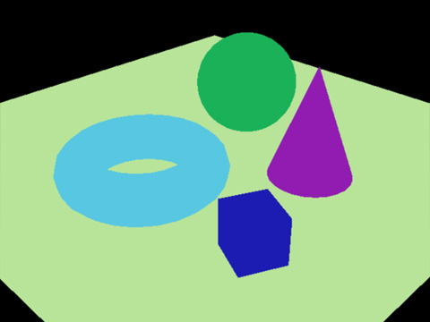
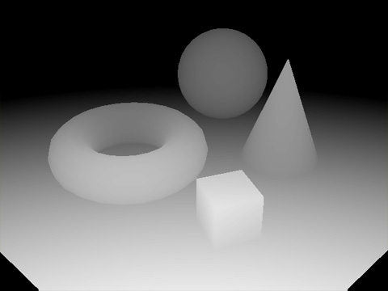
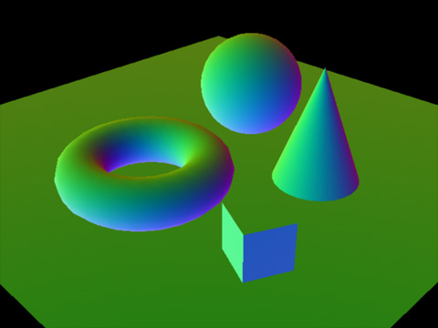
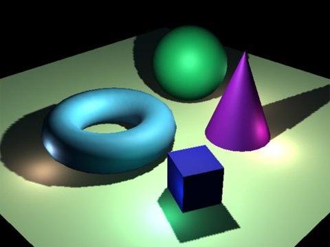

# Understanding Deferred Rendering in Vulkan

Deferred rendering is a powerful technique for handling complex lighting scenarios in 3D graphics. Unlike forward rendering, deferred rendering separates the geometry and lighting passes, which can significantly improve performance in scenes with many light sources. In this lesson, we'll break down how deferred rendering works by examining a Vulkan implementation.

## What is Deferred Rendering?

In traditional forward rendering, each object is rendered with all its lighting calculations in a single pass. This means that for every object, we need to consider every light in the scene, which can quickly become inefficient as the number of lights increases.

Deferred rendering takes a different approach:

1. **Geometry Pass**: Render the scene geometry and store various properties (position, normal, albedo, etc.) in multiple render targets, collectively called the G-Buffer
2. **Lighting Pass**: Process the G-Buffer to calculate lighting for the entire scene

This separation allows us to decouple the scene complexity (number of objects) from the lighting complexity (number of lights), often resulting in better performance for scenes with many light sources.

You can find a theorical description of deferred rendering here: https://en.wikipedia.org/wiki/Deferred_shading. Here is an exemple, where we first render a color pass, a depth pass and a normals pass.

  

We then compose everything with in the composition. Note that we compute shadows, which won't be done in this lesson, but in the shadow mapping deferred rendering.

 

## The G-Buffer

The G-Buffer (Geometry Buffer) consists of several textures, each storing different information about the scene:

- **Position**: World-space position of each fragment
- **Normal**: Surface normal vector at each fragment
- **Albedo**: Base color (and sometimes specular intensity in the alpha channel)
- **Depth**: Depth information for each fragment

Here's how these buffers are defined in our example code:

```cpp
// Define the structure for framebuffer attachments
// This stores all necessary components for a single attachment (image, memory, view, format)
struct FrameBufferAttachment {
    VkImage image;
    VkDeviceMemory mem;
    VkImageView view;
    VkFormat format;
};

// Define the main G-Buffer structure
// This contains all the attachments needed for deferred rendering
struct FrameBuffer {
    int32_t width, height;
    VkFramebuffer frameBuffer;
    // G-Buffer attachments for deferred rendering
    // One attachment for every component required for a deferred rendering setup
    FrameBufferAttachment position;  // For storing world-space positions
    FrameBufferAttachment normal;    // For storing surface normals
    FrameBufferAttachment albedo;    // For storing diffuse color and specular intensity
    FrameBufferAttachment depth;     // For storing depth information
    VkRenderPass renderPass;         // The render pass for this G-Buffer
} offScreenFrameBuf{};
```

## Implementation Walkthrough

Let's walk through the key components of deferred rendering in Vulkan.


### Necessary structs, constructor and destructor

Our code will be contained in this class.

```cpp
#include "vulkanexamplebase.h"
#include "VulkanglTFModel.h"

class VulkanExample : public VulkanExampleBase
{
public:
	int32_t debugDisplayTarget = 0;

    // Texture resources
    struct {
        struct {
            vks::Texture2D colorMap;    // Color/diffuse texture for the model
            vks::Texture2D normalMap;   // Normal map for the model
        } model;
        struct {
            vks::Texture2D colorMap;    // Color/diffuse texture for the floor
            vks::Texture2D normalMap;   // Normal map for the floor
        } floor;
    } textures;

    // 3D models
    struct {
        vkglTF::Model model;    // Main model to render
        vkglTF::Model floor;    // Floor model
    } models;

    // Uniform buffer for the offscreen rendering pass (G-Buffer generation)
    struct UniformDataOffscreen  {
        glm::mat4 projection;     // Projection matrix
        glm::mat4 model;          // Model matrix
        glm::mat4 view;           // View matrix
        glm::vec4 instancePos[3]; // Instance positions for rendering multiple objects
    } uniformDataOffscreen;

    // Light definition structure for the lighting pass
    struct Light {
        glm::vec4 position;   // Position of the light
        glm::vec3 color;      // Color of the light
        float radius;         // Radius/range of light influence
    };

    // Uniform buffer for the composition/lighting pass
    struct UniformDataComposition {
        Light lights[6];            // Array of light sources
        glm::vec4 viewPos;          // Camera position for specular calculations
        int debugDisplayTarget = 0; // Controls debug display mode
    } uniformDataComposition;

    // Uniform buffers
    struct {
        vks::Buffer offscreen;    // Buffer for the G-Buffer generation pass
        vks::Buffer composition;  // Buffer for the lighting/composition pass
    } uniformBuffers;

    // Graphics pipelines
    struct {
        VkPipeline offscreen{ VK_NULL_HANDLE };   // Pipeline for G-Buffer generation
        VkPipeline composition{ VK_NULL_HANDLE }; // Pipeline for lighting/composition
    } pipelines;
    
    VkPipelineLayout pipelineLayout{ VK_NULL_HANDLE }; // Pipeline layout for shader uniform bindings

    // Descriptor sets
    struct {
        VkDescriptorSet model{ VK_NULL_HANDLE };       // For rendering the model to G-Buffer
        VkDescriptorSet floor{ VK_NULL_HANDLE };       // For rendering the floor to G-Buffer
        VkDescriptorSet composition{ VK_NULL_HANDLE }; // For the lighting/composition pass
    } descriptorSets;

	VkDescriptorSetLayout descriptorSetLayout{ VK_NULL_HANDLE };

    // Sampler for G-Buffer texture sampling
    VkSampler colorSampler{ VK_NULL_HANDLE };

    // Command buffer for offscreen rendering (G-Buffer generation)
    VkCommandBuffer offScreenCmdBuffer{ VK_NULL_HANDLE };

	// Semaphore used to synchronize between offscreen and final scene rendering
	VkSemaphore offscreenSemaphore{ VK_NULL_HANDLE };

	VulkanExample() : VulkanExampleBase()
	{
		title = "Deferred shading";
		camera.type = Camera::CameraType::firstperson;
		camera.movementSpeed = 5.0f;
		camera.rotationSpeed = 0.25f;
		camera.position = { 2.15f, 0.3f, -8.75f };
		camera.setRotation(glm::vec3(-0.75f, 12.5f, 0.0f));
		camera.setPerspective(60.0f, (float)width / (float)height, 0.1f, 256.0f);
	}

	~VulkanExample()
	{
		if (device) {
			vkDestroySampler(device, colorSampler, nullptr);

            // Clean up G-Buffer resources

            // Position attachment
            vkDestroyImageView(device, offScreenFrameBuf.position.view, nullptr);
            vkDestroyImage(device, offScreenFrameBuf.position.image, nullptr);
            vkFreeMemory(device, offScreenFrameBuf.position.mem, nullptr);

            // Normal attachment
            vkDestroyImageView(device, offScreenFrameBuf.normal.view, nullptr);
            vkDestroyImage(device, offScreenFrameBuf.normal.image, nullptr);
            vkFreeMemory(device, offScreenFrameBuf.normal.mem, nullptr);

            // Albedo attachment
            vkDestroyImageView(device, offScreenFrameBuf.albedo.view, nullptr);
            vkDestroyImage(device, offScreenFrameBuf.albedo.image, nullptr);
            vkFreeMemory(device, offScreenFrameBuf.albedo.mem, nullptr);

			// Depth attachment
			vkDestroyImageView(device, offScreenFrameBuf.depth.view, nullptr);
			vkDestroyImage(device, offScreenFrameBuf.depth.image, nullptr);
			vkFreeMemory(device, offScreenFrameBuf.depth.mem, nullptr);

            // Framebuffer
            vkDestroyFramebuffer(device, offScreenFrameBuf.frameBuffer, nullptr);

            // Pipelines
            vkDestroyPipeline(device, pipelines.composition, nullptr);
            vkDestroyPipeline(device, pipelines.offscreen, nullptr);

            vkDestroyPipelineLayout(device, pipelineLayout, nullptr);

			vkDestroyDescriptorSetLayout(device, descriptorSetLayout, nullptr);

            // Uniform buffers
            uniformBuffers.offscreen.destroy();
            uniformBuffers.composition.destroy();

			vkDestroyRenderPass(device, offScreenFrameBuf.renderPass, nullptr);

            // Textures
            textures.model.colorMap.destroy();
            textures.model.normalMap.destroy();
            textures.floor.colorMap.destroy();
            textures.floor.normalMap.destroy();

			vkDestroySemaphore(device, offscreenSemaphore, nullptr);
		}
	}
    ...
```

### 1. G-Buffer Setup

First, we need to create the framebuffer attachments for our G-Buffer:

```cpp
// Prepare a new framebuffer and attachments for offscreen rendering (G-Buffer)
void prepareOffscreenFramebuffer()
{
    // Fixed size for the G-Buffer (independent of window size)
    // In a real application, you might want to match window size and recreate on resize
    offScreenFrameBuf.width = 2048;
    offScreenFrameBuf.height = 2048;

    // Create G-Buffer color attachments

    // Position buffer: Stores world-space positions with high precision
    createAttachment(
        VK_FORMAT_R16G16B16A16_SFLOAT,         // High precision format for position data
        VK_IMAGE_USAGE_COLOR_ATTACHMENT_BIT,   // Will be used as a color attachment
        &offScreenFrameBuf.position);

    // Normal buffer: Stores world-space normals with high precision
    createAttachment(
        VK_FORMAT_R16G16B16A16_SFLOAT,         // High precision format for normal data
        VK_IMAGE_USAGE_COLOR_ATTACHMENT_BIT,   // Will be used as a color attachment
        &offScreenFrameBuf.normal);

    // Albedo buffer: Stores diffuse color (and specular in alpha)
    createAttachment(
        VK_FORMAT_R8G8B8A8_UNORM,              // Standard format is sufficient for color
        VK_IMAGE_USAGE_COLOR_ATTACHMENT_BIT,   // Will be used as a color attachment
        &offScreenFrameBuf.albedo);

    // Create depth attachment

    // Find a suitable depth format supported by the device
    VkFormat attDepthFormat;
    VkBool32 validDepthFormat = vks::tools::getSupportedDepthFormat(physicalDevice, &attDepthFormat);
    assert(validDepthFormat);

    // Create the depth attachment
    createAttachment(
        attDepthFormat,
        VK_IMAGE_USAGE_DEPTH_STENCIL_ATTACHMENT_BIT,  // Will be used as depth/stencil
        &offScreenFrameBuf.depth);
    
    // Set up separate renderpass with references to the color and depth attachments
    ...
}
```

Let's look at how the attachments are created:

```cpp
// Helper function to create a framebuffer attachment
// Creates the image, allocates memory, and creates the image view
void createAttachment(
    VkFormat format,                  // Format for the attachment
    VkImageUsageFlagBits usage,       // How the attachment will be used
    FrameBufferAttachment *attachment // Output attachment object
)
{
    // Determine aspect mask and layout based on attachment type
    VkImageAspectFlags aspectMask = 0;
    VkImageLayout imageLayout;

    // Store the format
    attachment->format = format;

    // Setup based on whether this is a color or depth attachment
    if (usage & VK_IMAGE_USAGE_COLOR_ATTACHMENT_BIT)
    {
        // For color attachments, use color aspect and optimal color layout
        aspectMask = VK_IMAGE_ASPECT_COLOR_BIT;
        imageLayout = VK_IMAGE_LAYOUT_COLOR_ATTACHMENT_OPTIMAL;
    }
    if (usage & VK_IMAGE_USAGE_DEPTH_STENCIL_ATTACHMENT_BIT)
    {
        // For depth attachments, use depth aspect and optimal depth layout
        aspectMask = VK_IMAGE_ASPECT_DEPTH_BIT;
        // Add stencil aspect if the format includes stencil
        if (format >= VK_FORMAT_D16_UNORM_S8_UINT)
            aspectMask |= VK_IMAGE_ASPECT_STENCIL_BIT;
        imageLayout = VK_IMAGE_LAYOUT_DEPTH_STENCIL_ATTACHMENT_OPTIMAL;
    }

    // Make sure we have a valid aspect mask
    assert(aspectMask > 0);

    // Create image for the attachment
    VkImageCreateInfo image = vks::initializers::imageCreateInfo();
    image.imageType = VK_IMAGE_TYPE_2D;
    image.format = format;
    image.extent.width = offScreenFrameBuf.width;
    image.extent.height = offScreenFrameBuf.height;
    image.extent.depth = 1;
    image.mipLevels = 1;
    image.arrayLayers = 1;
    image.samples = VK_SAMPLE_COUNT_1_BIT;
    image.tiling = VK_IMAGE_TILING_OPTIMAL;
    // Add SAMPLED bit so we can read from it in shader
    image.usage = usage | VK_IMAGE_USAGE_SAMPLED_BIT;

    // Allocate memory for the image
    VkMemoryAllocateInfo memAlloc = vks::initializers::memoryAllocateInfo();
    VkMemoryRequirements memReqs;

    // Create the image
    VK_CHECK_RESULT(vkCreateImage(device, &image, nullptr, &attachment->image));
    
    // Get memory requirements based on image
    vkGetImageMemoryRequirements(device, attachment->image, &memReqs);
    memAlloc.allocationSize = memReqs.size;
    // Get appropriate memory type
    memAlloc.memoryTypeIndex = vulkanDevice->getMemoryType(memReqs.memoryTypeBits, VK_MEMORY_PROPERTY_DEVICE_LOCAL_BIT);
    
    // Allocate and bind memory
    VK_CHECK_RESULT(vkAllocateMemory(device, &memAlloc, nullptr, &attachment->mem));
    VK_CHECK_RESULT(vkBindImageMemory(device, attachment->image, attachment->mem, 0));

    // Create image view
    VkImageViewCreateInfo imageView = vks::initializers::imageViewCreateInfo();
    imageView.viewType = VK_IMAGE_VIEW_TYPE_2D;
    imageView.format = format;
    imageView.subresourceRange = {};
    imageView.subresourceRange.aspectMask = aspectMask;
    imageView.subresourceRange.baseMipLevel = 0;
    imageView.subresourceRange.levelCount = 1;
    imageView.subresourceRange.baseArrayLayer = 0;
    imageView.subresourceRange.layerCount = 1;
    imageView.image = attachment->image;
    
    // Create the view
    VK_CHECK_RESULT(vkCreateImageView(device, &imageView, nullptr, &attachment->view));
}
```

Note the different formats used for each attachment:
- Position and Normal use higher precision (16-bit per channel) to store accurate spatial information
- Albedo uses standard 8-bit per channel format for color information

Next, we need to set up a render pass for the G-Buffer:

From `prepareOffscreenFramebuffer()`:
```cpp
...
   // Set up separate renderpass with references to the color and depth attachments
   // This section creates a render pass that will write to our G-Buffer attachments
   
   // Create an array of attachment descriptions for all our G-Buffer components
   std::array<VkAttachmentDescription, 4> attachmentDescs = {};
   
   // Set common properties for all attachments
   for (uint32_t i = 0; i < 4; ++i)
   {
       attachmentDescs[i].samples = VK_SAMPLE_COUNT_1_BIT;         // No MSAA
       attachmentDescs[i].loadOp = VK_ATTACHMENT_LOAD_OP_CLEAR;    // Clear at start
       attachmentDescs[i].storeOp = VK_ATTACHMENT_STORE_OP_STORE;  // Store at end
       attachmentDescs[i].stencilLoadOp = VK_ATTACHMENT_LOAD_OP_DONT_CARE;  // No stencil
       attachmentDescs[i].stencilStoreOp = VK_ATTACHMENT_STORE_OP_DONT_CARE; // No stencil
       
       // Set initial and final layouts based on attachment type
       if (i == 3) // Depth attachment has different layout
       {
           attachmentDescs[i].initialLayout = VK_IMAGE_LAYOUT_UNDEFINED;
           attachmentDescs[i].finalLayout = VK_IMAGE_LAYOUT_DEPTH_STENCIL_ATTACHMENT_OPTIMAL;
       }
       else // Color attachments
       {
           attachmentDescs[i].initialLayout = VK_IMAGE_LAYOUT_UNDEFINED;
           // Set final layout to shader read optimal so we can sample in composition pass
           attachmentDescs[i].finalLayout = VK_IMAGE_LAYOUT_SHADER_READ_ONLY_OPTIMAL;
       }
   }
   
   // Assign formats to the attachments
   attachmentDescs[0].format = offScreenFrameBuf.position.format;  // Position
   attachmentDescs[1].format = offScreenFrameBuf.normal.format;    // Normal
   attachmentDescs[2].format = offScreenFrameBuf.albedo.format;    // Albedo
   attachmentDescs[3].format = offScreenFrameBuf.depth.format;     // Depth
   
   // Set up attachment references for the subpass
   // These link the attachments to specific binding points in the fragment shader
   std::vector<VkAttachmentReference> colorReferences;
   colorReferences.push_back({ 0, VK_IMAGE_LAYOUT_COLOR_ATTACHMENT_OPTIMAL });  // Position
   colorReferences.push_back({ 1, VK_IMAGE_LAYOUT_COLOR_ATTACHMENT_OPTIMAL });  // Normal
   colorReferences.push_back({ 2, VK_IMAGE_LAYOUT_COLOR_ATTACHMENT_OPTIMAL });  // Albedo
   
   // Depth attachment reference
   VkAttachmentReference depthReference = {};
   depthReference.attachment = 3;
   depthReference.layout = VK_IMAGE_LAYOUT_DEPTH_STENCIL_ATTACHMENT_OPTIMAL;
   
   // Define the render subpass
   VkSubpassDescription subpass = {};
   subpass.pipelineBindPoint = VK_PIPELINE_BIND_POINT_GRAPHICS;
   subpass.pColorAttachments = colorReferences.data();
   subpass.colorAttachmentCount = static_cast<uint32_t>(colorReferences.size());
   subpass.pDepthStencilAttachment = &depthReference;
   
   // Use subpass dependencies for attachment layout transitions
   // These control the timing of the layout transitions
   std::array<VkSubpassDependency, 2> dependencies;
   
   // Dependency at the start of the render pass
   dependencies[0].srcSubpass = VK_SUBPASS_EXTERNAL;  // Before the render pass
   dependencies[0].dstSubpass = 0;                    // Our subpass
   dependencies[0].srcStageMask = VK_PIPELINE_STAGE_BOTTOM_OF_PIPE_BIT;
   dependencies[0].dstStageMask = VK_PIPELINE_STAGE_COLOR_ATTACHMENT_OUTPUT_BIT;
   dependencies[0].srcAccessMask = VK_ACCESS_MEMORY_READ_BIT;
   dependencies[0].dstAccessMask = VK_ACCESS_COLOR_ATTACHMENT_READ_BIT | VK_ACCESS_COLOR_ATTACHMENT_WRITE_BIT;
   dependencies[0].dependencyFlags = VK_DEPENDENCY_BY_REGION_BIT;
   
   // Dependency at the end of the render pass
   dependencies[1].srcSubpass = 0;                    // Our subpass
   dependencies[1].dstSubpass = VK_SUBPASS_EXTERNAL;  // After the render pass
   dependencies[1].srcStageMask = VK_PIPELINE_STAGE_COLOR_ATTACHMENT_OUTPUT_BIT;
   dependencies[1].dstStageMask = VK_PIPELINE_STAGE_BOTTOM_OF_PIPE_BIT;
   dependencies[1].srcAccessMask = VK_ACCESS_COLOR_ATTACHMENT_READ_BIT | VK_ACCESS_COLOR_ATTACHMENT_WRITE_BIT;
   dependencies[1].dstAccessMask = VK_ACCESS_MEMORY_READ_BIT;
   dependencies[1].dependencyFlags = VK_DEPENDENCY_BY_REGION_BIT;
   
   // Create the render pass
   VkRenderPassCreateInfo renderPassInfo = {};
   renderPassInfo.sType = VK_STRUCTURE_TYPE_RENDER_PASS_CREATE_INFO;
   renderPassInfo.pAttachments = attachmentDescs.data();
   renderPassInfo.attachmentCount = static_cast<uint32_t>(attachmentDescs.size());
   renderPassInfo.subpassCount = 1;
   renderPassInfo.pSubpasses = &subpass;
   renderPassInfo.dependencyCount = 2;
   renderPassInfo.pDependencies = dependencies.data();
   
   // Create the actual render pass object
   VK_CHECK_RESULT(vkCreateRenderPass(device, &renderPassInfo, nullptr, &offScreenFrameBuf.renderPass));
   
   // Create the framebuffer with all attachments
   std::array<VkImageView,4> attachments;
   attachments[0] = offScreenFrameBuf.position.view;
   attachments[1] = offScreenFrameBuf.normal.view;
   attachments[2] = offScreenFrameBuf.albedo.view;
   attachments[3] = offScreenFrameBuf.depth.view;
   
   // Create the framebuffer
   VkFramebufferCreateInfo fbufCreateInfo = {};
   fbufCreateInfo.sType = VK_STRUCTURE_TYPE_FRAMEBUFFER_CREATE_INFO;
   fbufCreateInfo.pNext = NULL;
   fbufCreateInfo.renderPass = offScreenFrameBuf.renderPass;
   fbufCreateInfo.pAttachments = attachments.data();
   fbufCreateInfo.attachmentCount = static_cast<uint32_t>(attachments.size());
   fbufCreateInfo.width = offScreenFrameBuf.width;
   fbufCreateInfo.height = offScreenFrameBuf.height;
   fbufCreateInfo.layers = 1;
   VK_CHECK_RESULT(vkCreateFramebuffer(device, &fbufCreateInfo, nullptr, &offScreenFrameBuf.frameBuffer));
   
   // Create sampler to sample from the color attachments
   // This will be used in the lighting/composition pass to read from G-Buffer
   VkSamplerCreateInfo sampler = vks::initializers::samplerCreateInfo();
   sampler.magFilter = VK_FILTER_NEAREST;    // Use nearest filtering for precision
   sampler.minFilter = VK_FILTER_NEAREST;
   sampler.mipmapMode = VK_SAMPLER_MIPMAP_MODE_LINEAR;
   sampler.addressModeU = VK_SAMPLER_ADDRESS_MODE_CLAMP_TO_EDGE;
   sampler.addressModeV = sampler.addressModeU;
   sampler.addressModeW = sampler.addressModeU;
   sampler.mipLodBias = 0.0f;
   sampler.maxAnisotropy = 1.0f;
   sampler.minLod = 0.0f;
   sampler.maxLod = 1.0f;
   sampler.borderColor = VK_BORDER_COLOR_FLOAT_OPAQUE_WHITE;
   VK_CHECK_RESULT(vkCreateSampler(device, &sampler, nullptr, &colorSampler));
}
```

### 2. Geometry Pass (G-Buffer Generation)

In the geometry pass, we render the scene geometry to populate the G-Buffer. This is done using a special fragment shader that outputs position, normal, and albedo data to multiple render targets:

`mrt.frag` (MRT = Multiple Render Targets)
```glsl
#version 450

// Input textures from the descriptor set
layout (binding = 1) uniform sampler2D samplerColor;     // Albedo/color texture
layout (binding = 2) uniform sampler2D samplerNormalMap; // Normal map texture

// Inputs from the vertex shader
layout (location = 0) in vec3 inNormal;    // Vertex normal
layout (location = 1) in vec2 inUV;        // Texture coordinates
layout (location = 2) in vec3 inColor;     // Vertex color
layout (location = 3) in vec3 inWorldPos;  // World position
layout (location = 4) in vec3 inTangent;   // Tangent vector for normal mapping

// Multiple render target outputs - each one writes to a different G-Buffer texture
layout (location = 0) out vec4 outPosition; // Output world position
layout (location = 1) out vec4 outNormal;   // Output normal vector
layout (location = 2) out vec4 outAlbedo;   // Output color/albedo

void main() 
{
    // Output 1: World position to the position G-Buffer
    outPosition = vec4(inWorldPos, 1.0);

    // Output 2: Calculate and output normal in tangent space
    vec3 N = normalize(inNormal);
    vec3 T = normalize(inTangent);
    vec3 B = cross(N, T);           // Calculate bitangent vector
    mat3 TBN = mat3(T, B, N);       // Create tangent-to-world space matrix
    
    // Sample normal map and transform normal from tangent to world space
    vec3 tnorm = TBN * normalize(texture(samplerNormalMap, inUV).xyz * 2.0 - vec3(1.0));
    outNormal = vec4(tnorm, 1.0);

    // Output 3: Sample and output albedo (color) from texture
    outAlbedo = texture(samplerColor, inUV);
}
```

The vertex shader provides the necessary inputs:

`mrt.vert`
```glsl
#version 450

// Vertex input attributes
layout (location = 0) in vec4 inPos;      // Vertex position
layout (location = 1) in vec2 inUV;       // Texture coordinates
layout (location = 2) in vec3 inColor;    // Vertex color
layout (location = 3) in vec3 inNormal;   // Vertex normal
layout (location = 4) in vec3 inTangent;  // Vertex tangent

// Uniform buffer containing transformations and instance data
layout (binding = 0) uniform UBO 
{
    mat4 projection;        // Projection matrix
    mat4 model;             // Model matrix
    mat4 view;              // View matrix
    vec4 instancePos[3];    // Positions for instanced rendering
} ubo;

// Outputs to fragment shader
layout (location = 0) out vec3 outNormal;   // Normal vector
layout (location = 1) out vec2 outUV;       // Texture coordinates
layout (location = 2) out vec3 outColor;    // Vertex color
layout (location = 3) out vec3 outWorldPos; // World position
layout (location = 4) out vec3 outTangent;  // Tangent vector

void main() 
{
    // Add instance position offset (for instanced rendering)
    vec4 tmpPos = inPos + ubo.instancePos[gl_InstanceIndex];
    
    // Calculate clip space position
    gl_Position = ubo.projection * ubo.view * ubo.model * tmpPos;
    
    // Pass texture coordinates to fragment shader
    outUV = inUV;

    // Calculate world space position
    outWorldPos = vec3(ubo.model * tmpPos);
    
    // Calculate normal in world space
    // Use inverse transpose for correct normal transformation
    mat3 mNormal = transpose(inverse(mat3(ubo.model)));
    outNormal = mNormal * normalize(inNormal);    
    outTangent = mNormal * normalize(inTangent);
    
    // Pass vertex color to fragment shader
    outColor = inColor;
}
```

The command buffer for this pass renders all scene geometry to the G-Buffer:

```cpp
// Build command buffer for rendering the scene to the offscreen G-Buffer
// This creates a command buffer that writes to all G-Buffer attachments
void buildDeferredCommandBuffer()
{
    // Create command buffer if it doesn't exist yet
    if (offScreenCmdBuffer == VK_NULL_HANDLE) {
        offScreenCmdBuffer = vulkanDevice->createCommandBuffer(VK_COMMAND_BUFFER_LEVEL_PRIMARY, false);
    }

    // Create a semaphore for synchronizing offscreen rendering and composition pass
    VkSemaphoreCreateInfo semaphoreCreateInfo = vks::initializers::semaphoreCreateInfo();
    VK_CHECK_RESULT(vkCreateSemaphore(device, &semaphoreCreateInfo, nullptr, &offscreenSemaphore));

    // Set up command buffer begin info
    VkCommandBufferBeginInfo cmdBufInfo = vks::initializers::commandBufferBeginInfo();

    // Set up clear values for all G-Buffer attachments
    std::array<VkClearValue,4> clearValues;
    clearValues[0].color = { { 0.0f, 0.0f, 0.0f, 0.0f } };      // Position buffer (black)
    clearValues[1].color = { { 0.0f, 0.0f, 0.0f, 0.0f } };      // Normal buffer (black)
    clearValues[2].color = { { 0.0f, 0.0f, 0.0f, 0.0f } };      // Albedo buffer (black)
    clearValues[3].depthStencil = { 1.0f, 0 };                  // Depth buffer (far)

    // Set up render pass begin info
    VkRenderPassBeginInfo renderPassBeginInfo = vks::initializers::renderPassBeginInfo();
    renderPassBeginInfo.renderPass = offScreenFrameBuf.renderPass;
    renderPassBeginInfo.framebuffer = offScreenFrameBuf.frameBuffer;
    renderPassBeginInfo.renderArea.extent.width = offScreenFrameBuf.width;
    renderPassBeginInfo.renderArea.extent.height = offScreenFrameBuf.height;
    renderPassBeginInfo.clearValueCount = static_cast<uint32_t>(clearValues.size());
    renderPassBeginInfo.pClearValues = clearValues.data();

    // Begin command buffer recording
    VK_CHECK_RESULT(vkBeginCommandBuffer(offScreenCmdBuffer, &cmdBufInfo));

    // Begin the render pass - this is when our attachments get cleared
    vkCmdBeginRenderPass(offScreenCmdBuffer, &renderPassBeginInfo, VK_SUBPASS_CONTENTS_INLINE);

    // Set the viewport - this defines where we render (the entire framebuffer in this case)
    VkViewport viewport = vks::initializers::viewport((float)offScreenFrameBuf.width, (float)offScreenFrameBuf.height, 0.0f, 1.0f);
    vkCmdSetViewport(offScreenCmdBuffer, 0, 1, &viewport);

    // Set the scissor rectangle - this defines where rendering is clipped (the entire framebuffer in this case)
    VkRect2D scissor = vks::initializers::rect2D(offScreenFrameBuf.width, offScreenFrameBuf.height, 0, 0);
    vkCmdSetScissor(offScreenCmdBuffer, 0, 1, &scissor);

    // Bind the pipeline for G-Buffer generation
    // This pipeline contains the shaders that will write to multiple render targets
    vkCmdBindPipeline(offScreenCmdBuffer, VK_PIPELINE_BIND_POINT_GRAPHICS, pipelines.offscreen);

    // Render floor first
    // First bind the floor's descriptors containing textures and uniform buffers
    vkCmdBindDescriptorSets(offScreenCmdBuffer, VK_PIPELINE_BIND_POINT_GRAPHICS, pipelineLayout, 0, 1, &descriptorSets.floor, 0, nullptr);
    // Draw the floor model
    models.floor.draw(offScreenCmdBuffer);

    // Render 3D model with instancing
    // The same model will be drawn at multiple locations using instancing
    vkCmdBindDescriptorSets(offScreenCmdBuffer, VK_PIPELINE_BIND_POINT_GRAPHICS, pipelineLayout, 0, 1, &descriptorSets.model, 0, nullptr);
    // Bind the model's vertex and index buffers
    models.model.bindBuffers(offScreenCmdBuffer);
    // Draw 3 instances of the model
    // The instance positions are defined in the vertex shader via instancePos array
    vkCmdDrawIndexed(offScreenCmdBuffer, models.model.indices.count, 3, 0, 0, 0);

    // End the render pass - this is when the G-Buffer textures are transitioned to be readable in the next pass
    vkCmdEndRenderPass(offScreenCmdBuffer);

    // Finish recording the command buffer
    VK_CHECK_RESULT(vkEndCommandBuffer(offScreenCmdBuffer));
}
```

### 3. Setting up Descriptors for G-Buffer Rendering

To render to the G-Buffer and then read from it in the composition phase, we need to set up appropriate descriptor sets:

```cpp
void setupDescriptors()
{
    // Pool
    std::vector<VkDescriptorPoolSize> poolSizes = {
        vks::initializers::descriptorPoolSize(VK_DESCRIPTOR_TYPE_UNIFORM_BUFFER, 8),
        vks::initializers::descriptorPoolSize(VK_DESCRIPTOR_TYPE_COMBINED_IMAGE_SAMPLER, 9)
    };
    VkDescriptorPoolCreateInfo descriptorPoolInfo = vks::initializers::descriptorPoolCreateInfo(poolSizes, 3);
    VK_CHECK_RESULT(vkCreateDescriptorPool(device, &descriptorPoolInfo, nullptr, &descriptorPool));

    // Layouts
    std::vector<VkDescriptorSetLayoutBinding> setLayoutBindings = {
        // Binding 0 : Vertex shader uniform buffer
        vks::initializers::descriptorSetLayoutBinding(VK_DESCRIPTOR_TYPE_UNIFORM_BUFFER, VK_SHADER_STAGE_VERTEX_BIT, 0),
        // Binding 1 : Position texture target / Scene colormap
        vks::initializers::descriptorSetLayoutBinding(VK_DESCRIPTOR_TYPE_COMBINED_IMAGE_SAMPLER, VK_SHADER_STAGE_FRAGMENT_BIT, 1),
        // Binding 2 : Normals texture target
        vks::initializers::descriptorSetLayoutBinding(VK_DESCRIPTOR_TYPE_COMBINED_IMAGE_SAMPLER, VK_SHADER_STAGE_FRAGMENT_BIT, 2),
        // Binding 3 : Albedo texture target
        vks::initializers::descriptorSetLayoutBinding(VK_DESCRIPTOR_TYPE_COMBINED_IMAGE_SAMPLER, VK_SHADER_STAGE_FRAGMENT_BIT, 3),
        // Binding 4 : Fragment shader uniform buffer
        vks::initializers::descriptorSetLayoutBinding(VK_DESCRIPTOR_TYPE_UNIFORM_BUFFER, VK_SHADER_STAGE_FRAGMENT_BIT, 4),
    };
    VkDescriptorSetLayoutCreateInfo descriptorLayout = vks::initializers::descriptorSetLayoutCreateInfo(setLayoutBindings);
    VK_CHECK_RESULT(vkCreateDescriptorSetLayout(device, &descriptorLayout, nullptr, &descriptorSetLayout));
    
    // Sets
    std::vector<VkWriteDescriptorSet> writeDescriptorSets;
    VkDescriptorSetAllocateInfo allocInfo = vks::initializers::descriptorSetAllocateInfo(descriptorPool, &descriptorSetLayout, 1);

    // Image descriptors for the offscreen color attachments
    VkDescriptorImageInfo texDescriptorPosition =
        vks::initializers::descriptorImageInfo(
            colorSampler,
            offScreenFrameBuf.position.view,
            VK_IMAGE_LAYOUT_SHADER_READ_ONLY_OPTIMAL);

    VkDescriptorImageInfo texDescriptorNormal =
        vks::initializers::descriptorImageInfo(
            colorSampler,
            offScreenFrameBuf.normal.view,
            VK_IMAGE_LAYOUT_SHADER_READ_ONLY_OPTIMAL);

    VkDescriptorImageInfo texDescriptorAlbedo =
        vks::initializers::descriptorImageInfo(
            colorSampler,
            offScreenFrameBuf.albedo.view,
            VK_IMAGE_LAYOUT_SHADER_READ_ONLY_OPTIMAL);

    // Deferred composition descriptor set
    VK_CHECK_RESULT(vkAllocateDescriptorSets(device, &allocInfo, &descriptorSets.composition));
    writeDescriptorSets = {
        // Binding 1 : Position texture target
        vks::initializers::writeDescriptorSet(descriptorSets.composition, VK_DESCRIPTOR_TYPE_COMBINED_IMAGE_SAMPLER, 1, &texDescriptorPosition),
        // Binding 2 : Normals texture target
        vks::initializers::writeDescriptorSet(descriptorSets.composition, VK_DESCRIPTOR_TYPE_COMBINED_IMAGE_SAMPLER, 2, &texDescriptorNormal),
        // Binding 3 : Albedo texture target
        vks::initializers::writeDescriptorSet(descriptorSets.composition, VK_DESCRIPTOR_TYPE_COMBINED_IMAGE_SAMPLER, 3, &texDescriptorAlbedo),
        // Binding 4 : Fragment shader uniform buffer
        vks::initializers::writeDescriptorSet(descriptorSets.composition, VK_DESCRIPTOR_TYPE_UNIFORM_BUFFER, 4, &uniformBuffers.composition.descriptor),
    };
    vkUpdateDescriptorSets(device, static_cast<uint32_t>(writeDescriptorSets.size()), writeDescriptorSets.data(), 0, nullptr);

    // Offscreen (scene)

     // Model
     VK_CHECK_RESULT(vkAllocateDescriptorSets(device, &allocInfo, &descriptorSets.model));
     writeDescriptorSets = {
         // Binding 0: Vertex shader uniform buffer
         vks::initializers::writeDescriptorSet(descriptorSets.model, VK_DESCRIPTOR_TYPE_UNIFORM_BUFFER, 0, &uniformBuffers.offscreen.descriptor),
         // Binding 1: Color map
         vks::initializers::writeDescriptorSet(descriptorSets.model, VK_DESCRIPTOR_TYPE_COMBINED_IMAGE_SAMPLER, 1, &textures.model.colorMap.descriptor),
         // Binding 2: Normal map
         vks::initializers::writeDescriptorSet(descriptorSets.model, VK_DESCRIPTOR_TYPE_COMBINED_IMAGE_SAMPLER, 2, &textures.model.normalMap.descriptor)
     };
     vkUpdateDescriptorSets(device, static_cast<uint32_t>(writeDescriptorSets.size()), writeDescriptorSets.data(), 0, nullptr);

     // Background
     VK_CHECK_RESULT(vkAllocateDescriptorSets(device, &allocInfo, &descriptorSets.floor));
     writeDescriptorSets = {
         // Binding 0: Vertex shader uniform buffer
         vks::initializers::writeDescriptorSet(descriptorSets.floor, VK_DESCRIPTOR_TYPE_UNIFORM_BUFFER, 0, &uniformBuffers.offscreen.descriptor),
         // Binding 1: Color map
         vks::initializers::writeDescriptorSet(descriptorSets.floor, VK_DESCRIPTOR_TYPE_COMBINED_IMAGE_SAMPLER, 1, &textures.floor.colorMap.descriptor),
         // Binding 2: Normal map
         vks::initializers::writeDescriptorSet(descriptorSets.floor, VK_DESCRIPTOR_TYPE_COMBINED_IMAGE_SAMPLER, 2, &textures.floor.normalMap.descriptor)
     };
     vkUpdateDescriptorSets(device, static_cast<uint32_t>(writeDescriptorSets.size()), writeDescriptorSets.data(), 0, nullptr);
}
```

### 4. Lighting Pass (Composition)

After filling the G-Buffer, we perform the lighting pass. This is where we calculate lighting for the entire scene using the data stored in the G-Buffer. The vertex shader for this pass is very simple - it just generates a full-screen quad:

`deferred.vert`
```glsl
#version 450

// Output texture coordinates to the fragment shader
// These will be used to sample from the G-Buffer textures
layout (location = 0) out vec2 outUV;

void main()
{
   // This is a clever trick to render a full-screen triangle with just 3 vertices
   // without needing any vertex buffer or vertex input

   // When gl_VertexIndex is:
   // 0 -> outUV = (0,0) -> bottom-left corner
   // 1 -> outUV = (2,0) -> bottom-right (extends beyond screen)
   // 2 -> outUV = (0,2) -> top-left (extends beyond screen)
   // This creates a large triangle that covers the entire screen with just 3 vertices
   outUV = vec2((gl_VertexIndex << 1) & 2, gl_VertexIndex & 2);

   // Convert UV coordinates to normalized device coordinates (NDC)
   // Transforms from [0,2] range to [-1,1] range needed for clip space
   // The z=0 (middle of clip space) and w=1 (no perspective division effect)
   gl_Position = vec4(outUV * 2.0f - 1.0f, 0.0f, 1.0f);
}
```

The fragment shader does the heavy lifting, sampling from the G-Buffer and performing lighting calculations:

`deferred.frag`
```glsl
#version 450

// G-Buffer texture samplers - each represents one component of our G-Buffer
layout (binding = 1) uniform sampler2D samplerposition;  // World space positions 
layout (binding = 2) uniform sampler2D samplerNormal;    // Surface normals
layout (binding = 3) uniform sampler2D samplerAlbedo;    // Diffuse color + specular intensity

// Input texture coordinates from vertex shader
// Used to sample from our G-Buffer textures
layout (location = 0) in vec2 inUV;

// Output final color after lighting
layout (location = 0) out vec4 outFragcolor;

// Light source definition
struct Light {
   vec4 position;    // World space position of the light
   vec3 color;       // RGB color/intensity of the light
   float radius;     // Radius of influence (for attenuation)
};

// Uniform buffer containing all lighting information
layout (binding = 4) uniform UBO
{
   Light lights[6];          // Array of 6 light sources
   vec4 viewPos;             // Camera position (for specular calculations)
   int displayDebugTarget;   // Which G-Buffer to display (debugging)
} ubo;

void main()
{
   // Step 1: Sample all relevant data from G-Buffer textures at the current fragment's UV
   vec3 fragPos = texture(samplerposition, inUV).rgb;  // World position
   vec3 normal = texture(samplerNormal, inUV).rgb;     // Surface normal
   vec4 albedo = texture(samplerAlbedo, inUV);         // RGB = diffuse color, A = specular intensity

   // Step 2: Debug visualization mode
   // If enabled, we'll just display one of the G-Buffer components directly
   if (ubo.displayDebugTarget > 0) {
      switch (ubo.displayDebugTarget) {
         case 1:
              outFragcolor.rgb = fragPos;   // Show world positions
              break;
         case 2:
              outFragcolor.rgb = normal;    // Show normals
              break;
         case 3:
              outFragcolor.rgb = albedo.rgb;  // Show albedo/diffuse color
              break;
         case 4:
              outFragcolor.rgb = albedo.aaa;  // Show specular intensity (stored in alpha)
              break;
      }
      outFragcolor.a = 1.0;  // Full opacity
      return;                // Skip lighting calculations
   }

   // Step 3: Start composition with ambient lighting
   #define lightCount 6       // Number of lights to process
    #define ambient 0.0        // Ambient light level (0.0 = no ambient)

   // Initialize with ambient light contribution only
   // Since ambient is 0, this starts with black color
   vec3 fragcolor = albedo.rgb * ambient;

   // Step 4: Calculate contribution from each light source
   for(int i = 0; i < lightCount; ++i)
   {
      // Calculate vector from fragment to light
      vec3 L = ubo.lights[i].position.xyz - fragPos;

      // Calculate distance to light for attenuation
      float dist = length(L);

      // Calculate view vector (fragment to camera)
      vec3 V = ubo.viewPos.xyz - fragPos;
      V = normalize(V);

      // We could check if the fragment is within light radius
      // and skip calculation if it's too far, but we don't here
      //if(dist < ubo.lights[i].radius)
      {
         // Normalize light direction vector
         L = normalize(L);

         // Step 5: Calculate light attenuation (falloff with distance)
         // This formula gives a smooth quadratic falloff that doesn't go to zero
         float atten = ubo.lights[i].radius / (pow(dist, 2.0) + 1.0);

         // Step 6: Calculate diffuse lighting (Lambert model)
         vec3 N = normalize(normal);
         // NdotL = cosine of angle between light and normal
         // Max prevents negative lighting when light is behind surface
         float NdotL = max(0.0, dot(N, L));
         // Diffuse = light color * surface color * light angle * attenuation
         vec3 diff = ubo.lights[i].color * albedo.rgb * NdotL * atten;

         // Step 7: Calculate specular lighting (Phong model)
         // Calculate reflection vector
         vec3 R = reflect(-L, N);
         // Calculate angle between reflection and view direction
         float NdotR = max(0.0, dot(R, V));
         // Apply specular power for a tighter highlight (16.0)
         // Use albedo.a as specular intensity/shininess
         vec3 spec = ubo.lights[i].color * albedo.a * pow(NdotR, 16.0) * atten;

         // Step 8: Add this light's contribution to the final color
         fragcolor += diff + spec;
      }
   }

   // Step 9: Output final color with full opacity
   outFragcolor = vec4(fragcolor, 1.0);
}
```

The main composition pass is a full-screen render that applies the lighting calculations:

```cpp
// This function builds the command buffers for the composition pass
// These command buffers draw a full-screen triangle that executes our lighting shader
void buildCommandBuffers()
{
   // Standard command buffer begin info structure
   VkCommandBufferBeginInfo cmdBufInfo = vks::initializers::commandBufferBeginInfo();
   
   // Set clear values for the swapchain framebuffer
   VkClearValue clearValues[2];
   clearValues[0].color = { { 0.0f, 0.0f, 0.2f, 0.0f } };  // Dark blue background color
   clearValues[1].depthStencil = { 1.0f, 0 };              // Far plane for depth buffer, 0 for stencil
   
   // Set up render pass begin info for the composition pass
   VkRenderPassBeginInfo renderPassBeginInfo = vks::initializers::renderPassBeginInfo();
   renderPassBeginInfo.renderPass = renderPass;            // The default render pass (for final output)
   renderPassBeginInfo.renderArea.offset.x = 0;            // Start at top-left corner
   renderPassBeginInfo.renderArea.offset.y = 0;
   renderPassBeginInfo.renderArea.extent.width = width;    // Full window size
   renderPassBeginInfo.renderArea.extent.height = height;
   renderPassBeginInfo.clearValueCount = 2;                // One for color, one for depth/stencil
   renderPassBeginInfo.pClearValues = clearValues;
   
   // Create a command buffer for each swapchain image
   for (int32_t i = 0; i < drawCmdBuffers.size(); ++i)
   {
      // Set the framebuffer for this specific swapchain image
      renderPassBeginInfo.framebuffer = frameBuffers[i];
      
      // Begin recording commands for this framebuffer
      VK_CHECK_RESULT(vkBeginCommandBuffer(drawCmdBuffers[i], &cmdBufInfo));
      
      // Begin the render pass - this is when the framebuffer is cleared
      vkCmdBeginRenderPass(drawCmdBuffers[i], &renderPassBeginInfo, VK_SUBPASS_CONTENTS_INLINE);
      
      // Set the viewport to cover the entire framebuffer
      VkViewport viewport = vks::initializers::viewport((float)width, (float)height, 0.0f, 1.0f);
      vkCmdSetViewport(drawCmdBuffers[i], 0, 1, &viewport);
      
      // Set the scissor rectangle to match the viewport
      VkRect2D scissor = vks::initializers::rect2D(width, height, 0, 0);
      vkCmdSetScissor(drawCmdBuffers[i], 0, 1, &scissor);
      
      // Bind the descriptor set that contains the G-Buffer texture samplers
      // This gives our shader access to the G-Buffer textures filled in the previous pass
      vkCmdBindDescriptorSets(
         drawCmdBuffers[i],                      // Command buffer
         VK_PIPELINE_BIND_POINT_GRAPHICS,        // Pipeline bind point (graphics, not compute)
         pipelineLayout,                         // Pipeline layout with descriptor set layouts
         0,                                      // First set index
         1,                                      // Number of sets to bind
         &descriptorSets.composition,            // The descriptor set with G-Buffer samplers
         0, nullptr);                            // No dynamic offsets
      
      // Bind the composition pipeline that contains the lighting shader
      vkCmdBindPipeline(
         drawCmdBuffers[i],                      // Command buffer
         VK_PIPELINE_BIND_POINT_GRAPHICS,        // Pipeline bind point
         pipelines.composition);                 // The composition pipeline
      
      // Final composition - this is the key part of deferred rendering's second pass
      // We draw a full screen triangle (3 vertices) in a single instance
      // The vertex shader generates vertices procedurally (no vertex buffer needed)
      // The fragment shader samples the G-Buffer textures and calculates lighting
      vkCmdDraw(
         drawCmdBuffers[i],                      // Command buffer
         3,                                      // Vertex count (for full-screen triangle)
         1,                                      // Instance count
         0, 0);                                  // First vertex and instance indices
      
      // Draw any UI elements on top of the rendered scene
      drawUI(drawCmdBuffers[i]);
      
      // End the render pass
      vkCmdEndRenderPass(drawCmdBuffers[i]);
      
      // Finish recording commands for this framebuffer
      VK_CHECK_RESULT(vkEndCommandBuffer(drawCmdBuffers[i]));
   }
}
```

### 5. Pipelines creation

We create two pipelines: one for the G-Buffer generation and one for the composition pass. The G-Buffer pipeline uses multiple render targets, while the composition pipeline is a simple full-screen quad.

```cpp
// This function creates the two graphics pipelines needed for deferred rendering:
// 1. G-Buffer pipeline for writing geometry data to multiple render targets
// 2. Composition pipeline for the lighting pass using the G-Buffer data
void preparePipelines()
{
   // Create a pipeline layout that defines what descriptor sets our shaders will use
   VkPipelineLayoutCreateInfo pipelineLayoutCreateInfo = vks::initializers::pipelineLayoutCreateInfo(
      &descriptorSetLayout,                // The descriptor set layout defined earlier
      1);                                  // Only one descriptor set layout
   VK_CHECK_RESULT(vkCreatePipelineLayout(device, &pipelineLayoutCreateInfo, nullptr, &pipelineLayout));
   
   // Set up common pipeline state configurations that will be shared between both pipelines
   
   // Input assembly - defines how to interpret vertex data
   VkPipelineInputAssemblyStateCreateInfo inputAssemblyState =
      vks::initializers::pipelineInputAssemblyStateCreateInfo(
         VK_PRIMITIVE_TOPOLOGY_TRIANGLE_LIST,  // Use triangle lists
         0,                                    // No primitive restart index
         VK_FALSE);                            // Don't use primitive restart
   
   // Rasterization state - controls polygon rasterization
   VkPipelineRasterizationStateCreateInfo rasterizationState =
      vks::initializers::pipelineRasterizationStateCreateInfo(
         VK_POLYGON_MODE_FILL,                 // Fill polygons with fragments
         VK_CULL_MODE_BACK_BIT,                // Cull back faces
         VK_FRONT_FACE_COUNTER_CLOCKWISE,      // Counter-clockwise vertex order defines front faces
         0);                                   // No depth bias
   
   // Color blend attachment - controls how color output is blended
   VkPipelineColorBlendAttachmentState blendAttachmentState =
      vks::initializers::pipelineColorBlendAttachmentState(
         0xf,                                  // Write to all color components (RGBA)
         VK_FALSE);                            // Disable blending (no transparency
         
   // Color blend state - container for attachment blend states
   VkPipelineColorBlendStateCreateInfo colorBlendState =
      vks::initializers::pipelineColorBlendStateCreateInfo(
         1,                                    // Initially one attachment
         &blendAttachmentState);               // The blend attachment state
      
   // Depth stencil state - controls depth and stencil tests
   VkPipelineDepthStencilStateCreateInfo depthStencilState =
      vks::initializers::pipelineDepthStencilStateCreateInfo(
         VK_TRUE,                              // Enable depth test
         VK_TRUE,                              // Enable depth write
         VK_COMPARE_OP_LESS_OR_EQUAL);         // Depth test function
         
   // Viewport state - defines viewport and scissor regions
   VkPipelineViewportStateCreateInfo viewportState =
      vks::initializers::pipelineViewportStateCreateInfo(
         1,                                    // One viewport
         1,                                    // One scissor rectangle
         0);                                   // No static viewport/scissor
         
   // Multisample state - controls multisampling for anti-aliasing
   VkPipelineMultisampleStateCreateInfo multisampleState =
      vks::initializers::pipelineMultisampleStateCreateInfo(
         VK_SAMPLE_COUNT_1_BIT,                // No multisampling (1 sample per pixel)
         0);                                   // No shader sample shading
         
   // Dynamic state - list of states that can be changed dynamically
   std::vector<VkDynamicState> dynamicStateEnables = {
      VK_DYNAMIC_STATE_VIEWPORT,                // Dynamic viewport
      VK_DYNAMIC_STATE_SCISSOR                  // Dynamic scissor
   };
   VkPipelineDynamicStateCreateInfo dynamicState =
      vks::initializers::pipelineDynamicStateCreateInfo(dynamicStateEnables);   // List of dynamic states
      
   // Shader stages array - will hold both vertex and fragment shader
   std::array<VkPipelineShaderStageCreateInfo, 2> shaderStages;
   
   // Base pipeline creation structure with shared configuration
   VkGraphicsPipelineCreateInfo pipelineCI = vks::initializers::pipelineCreateInfo(
      pipelineLayout,                          // Our pipeline layout with descriptors
      renderPass);                             // Default render pass (for final output)
   pipelineCI.pInputAssemblyState = &inputAssemblyState;
   pipelineCI.pRasterizationState = &rasterizationState;
   pipelineCI.pColorBlendState = &colorBlendState;
   pipelineCI.pMultisampleState = &multisampleState;
   pipelineCI.pViewportState = &viewportState;
   pipelineCI.pDepthStencilState = &depthStencilState;
   pipelineCI.pDynamicState = &dynamicState;
   pipelineCI.stageCount = static_cast<uint32_t>(shaderStages.size());
   pipelineCI.pStages = shaderStages.data();
   
   // PIPELINE 1: COMPOSITION PIPELINE FOR LIGHTING PASS
   // This pipeline renders a full-screen triangle to apply lighting calculations
   
   // For the full-screen triangle, we use front-face culling
   // This is because the large triangle extends beyond the screen
   // and we only want to render the part inside the screen
   rasterizationState.cullMode = VK_CULL_MODE_FRONT_BIT;
   
   // Load deferred lighting shaders
   shaderStages[0] = loadShader(getShadersPath() + "deferred/deferred.vert.spv", VK_SHADER_STAGE_VERTEX_BIT);
   shaderStages[1] = loadShader(getShadersPath() + "deferred/deferred.frag.spv", VK_SHADER_STAGE_FRAGMENT_BIT);
   
   // No vertex input state - the vertex shader generates vertices procedurally
   // This is a key optimization for the full-screen pass
   VkPipelineVertexInputStateCreateInfo emptyInputState = vks::initializers::pipelineVertexInputStateCreateInfo();
   pipelineCI.pVertexInputState = &emptyInputState;
   
   // Create the composition pipeline
   VK_CHECK_RESULT(vkCreateGraphicsPipelines(device, pipelineCache, 1, &pipelineCI, nullptr, &pipelines.composition));
   
   // PIPELINE 2: G-BUFFER PIPELINE FOR GEOMETRY PASS
   
   // Set vertex input state for the glTF model
   // This defines the vertex attributes and bindings for the 3D models
   pipelineCI.pVertexInputState = vkglTF::Vertex::getPipelineVertexInputState({
   vkglTF::VertexComponent::Position,     // World position
   vkglTF::VertexComponent::UV,           // Texture coordinates
   vkglTF::VertexComponent::Color,        // Vertex colors
   vkglTF::VertexComponent::Normal,       // Surface normals
   vkglTF::VertexComponent::Tangent       // Tangent vectors for normal mapping
   });
   
   // Switch back to back-face culling for normal geometry rendering
   rasterizationState.cullMode = VK_CULL_MODE_BACK_BIT;
   
   // Load multiple render target (MRT) shaders for G-Buffer generation
   shaderStages[0] = loadShader(getShadersPath() + "deferred/mrt.vert.spv", VK_SHADER_STAGE_VERTEX_BIT);
   shaderStages[1] = loadShader(getShadersPath() + "deferred/mrt.frag.spv", VK_SHADER_STAGE_FRAGMENT_BIT);
   
   // Use the offscreen render pass created for G-Buffer generation
   pipelineCI.renderPass = offScreenFrameBuf.renderPass;
   
   // Create blend states for multiple render targets (G-Buffer)
   // Each of our three G-Buffer attachments needs its own blend state
   // Even though we're not actually blending, we need to enable color writes for each attachment
   std::array<VkPipelineColorBlendAttachmentState, 3> blendAttachmentStates = {
      vks::initializers::pipelineColorBlendAttachmentState(0xf, VK_FALSE),  // Position attachment
      vks::initializers::pipelineColorBlendAttachmentState(0xf, VK_FALSE),  // Normal attachment
      vks::initializers::pipelineColorBlendAttachmentState(0xf, VK_FALSE)   // Albedo attachment
   };
   
   // Update color blend state to use all three G-Buffer attachments
   // This is critical - we need to write to all attachments simultaneously
   colorBlendState.attachmentCount = static_cast<uint32_t>(blendAttachmentStates.size());
   colorBlendState.pAttachments = blendAttachmentStates.data();
   
   // Create the G-Buffer generation pipeline
   VK_CHECK_RESULT(vkCreateGraphicsPipelines(device, pipelineCache, 1, &pipelineCI, nullptr, &pipelines.offscreen));
}
```


### 6. Light Management and Animation

Here is the code for managing lights and animating them:

```cpp
// Update lights and parameters passed to the composition shaders
void updateUniformBufferComposition()
{
   // White
   uniformDataComposition.lights[0].position = glm::vec4(0.0f, 0.0f, 1.0f, 0.0f);
   uniformDataComposition.lights[0].color = glm::vec3(1.5f);
   uniformDataComposition.lights[0].radius = 15.0f * 0.25f;
   // Red
   uniformDataComposition.lights[1].position = glm::vec4(-2.0f, 0.0f, 0.0f, 0.0f);
   uniformDataComposition.lights[1].color = glm::vec3(1.0f, 0.0f, 0.0f);
   uniformDataComposition.lights[1].radius = 15.0f;
   // Blue
   uniformDataComposition.lights[2].position = glm::vec4(2.0f, -1.0f, 0.0f, 0.0f);
   uniformDataComposition.lights[2].color = glm::vec3(0.0f, 0.0f, 2.5f);
   uniformDataComposition.lights[2].radius = 5.0f;
   // Yellow
   uniformDataComposition.lights[3].position = glm::vec4(0.0f, -0.9f, 0.5f, 0.0f);
   uniformDataComposition.lights[3].color = glm::vec3(1.0f, 1.0f, 0.0f);
   uniformDataComposition.lights[3].radius = 2.0f;
   // Green
   uniformDataComposition.lights[4].position = glm::vec4(0.0f, -0.5f, 0.0f, 0.0f);
   uniformDataComposition.lights[4].color = glm::vec3(0.0f, 1.0f, 0.2f);
   uniformDataComposition.lights[4].radius = 5.0f;
   // Yellow
   uniformDataComposition.lights[5].position = glm::vec4(0.0f, -1.0f, 0.0f, 0.0f);
   uniformDataComposition.lights[5].color = glm::vec3(1.0f, 0.7f, 0.3f);
   uniformDataComposition.lights[5].radius = 25.0f;
   
   // Animate the lights
   if (!paused) {
      uniformDataComposition.lights[0].position.x = sin(glm::radians(360.0f * timer)) * 5.0f;
      uniformDataComposition.lights[0].position.z = cos(glm::radians(360.0f * timer)) * 5.0f;
      
      uniformDataComposition.lights[1].position.x = -4.0f + sin(glm::radians(360.0f * timer) + 45.0f) * 2.0f;
      uniformDataComposition.lights[1].position.z = 0.0f + cos(glm::radians(360.0f * timer) + 45.0f) * 2.0f;
      
      uniformDataComposition.lights[2].position.x = 4.0f + sin(glm::radians(360.0f * timer)) * 2.0f;
      uniformDataComposition.lights[2].position.z = 0.0f + cos(glm::radians(360.0f * timer)) * 2.0f;
      
      uniformDataComposition.lights[4].position.x = 0.0f + sin(glm::radians(360.0f * timer + 90.0f)) * 5.0f;
      uniformDataComposition.lights[4].position.z = 0.0f - cos(glm::radians(360.0f * timer + 45.0f)) * 5.0f;
      
      uniformDataComposition.lights[5].position.x = 0.0f + sin(glm::radians(-360.0f * timer + 135.0f)) * 10.0f;
      uniformDataComposition.lights[5].position.z = 0.0f - cos(glm::radians(-360.0f * timer - 45.0f)) * 10.0f;
   }
   
   // Current view position
   uniformDataComposition.viewPos = glm::vec4(camera.position, 0.0f) * glm::vec4(-1.0f, 1.0f, -1.0f, 1.0f);
   
   uniformDataComposition.debugDisplayTarget = debugDisplayTarget;
   
   memcpy(uniformBuffers.composition.mapped, &uniformDataComposition, sizeof(UniformDataComposition));
}
```
### 6. Preparing uniform buffers

We finally need to prepare the uniform buffers for the G-Buffer and composition passes. The update functions will also be called in the main loop to update the uniform data:
```cpp
// Prepare and initialize uniform buffer containing shader uniforms
void prepareUniformBuffers()
{
     // Offscreen vertex shader
     VK_CHECK_RESULT(vulkanDevice->createBuffer(VK_BUFFER_USAGE_UNIFORM_BUFFER_BIT, VK_MEMORY_PROPERTY_HOST_VISIBLE_BIT | VK_MEMORY_PROPERTY_HOST_COHERENT_BIT, &uniformBuffers.offscreen, sizeof(UniformDataOffscreen)));

     // Deferred fragment shader
     VK_CHECK_RESULT(vulkanDevice->createBuffer(VK_BUFFER_USAGE_UNIFORM_BUFFER_BIT, VK_MEMORY_PROPERTY_HOST_VISIBLE_BIT | VK_MEMORY_PROPERTY_HOST_COHERENT_BIT, &uniformBuffers.composition, sizeof(UniformDataComposition)));

     // Map persistent
     VK_CHECK_RESULT(uniformBuffers.offscreen.map());
     VK_CHECK_RESULT(uniformBuffers.composition.map());

     // Setup instanced model positions
     uniformDataOffscreen.instancePos[0] = glm::vec4(0.0f);
     uniformDataOffscreen.instancePos[1] = glm::vec4(-4.0f, 0.0, -4.0f, 0.0f);
     uniformDataOffscreen.instancePos[2] = glm::vec4(4.0f, 0.0, -4.0f, 0.0f);

     // Update
     updateUniformBufferOffscreen();
     updateUniformBufferComposition();
}

// Update matrices used for the offscreen rendering of the scene
void updateUniformBufferOffscreen()
{
     uniformDataOffscreen.projection = camera.matrices.perspective;
     uniformDataOffscreen.view = camera.matrices.view;
     uniformDataOffscreen.model = glm::mat4(1.0f);
     memcpy(uniformBuffers.offscreen.mapped, &uniformDataOffscreen, sizeof(UniformDataOffscreen));
}
```

### 7. Wrapping up preparations

We can now call all preparation function:
```cpp
 void prepare()
 {
     VulkanExampleBase::prepare();
     loadAssets();
     prepareOffscreenFramebuffer();
     prepareUniformBuffers();
     setupDescriptors();
     preparePipelines();
     buildCommandBuffers();
     buildDeferredCommandBuffer();
     prepared = true;
 }
```


### 8. Rendering Process Flow and Synchronization

A key aspect of deferred rendering is coordinating the sequence of render passes. The example handles this with explicit synchronization:

```cpp
void draw()
{
    VulkanExampleBase::prepareFrame();

    // The scene render command buffer has to wait for the offscreen
    // rendering to be finished before we can use the framebuffer
    // color image for sampling during final rendering
    
    // To ensure this we use a dedicated offscreen synchronization
    // semaphore that will be signaled when offscreen rendering
    // has been finished
    
    // This is necessary as an implementation may start both
    // command buffers at the same time, there is no guarantee
    // that command buffers will be executed in the order they
    // have been submitted by the application

    // Offscreen rendering

    // Wait for swap chain presentation to finish
    submitInfo.pWaitSemaphores = &semaphores.presentComplete;
    // Signal ready with offscreen semaphore
    submitInfo.pSignalSemaphores = &offscreenSemaphore;

    // Submit work
    submitInfo.commandBufferCount = 1;
    submitInfo.pCommandBuffers = &offScreenCmdBuffer;
    VK_CHECK_RESULT(vkQueueSubmit(queue, 1, &submitInfo, VK_NULL_HANDLE));

    // Scene rendering

    // Wait for offscreen semaphore
    submitInfo.pWaitSemaphores = &offscreenSemaphore;
    // Signal ready with render complete semaphore
    submitInfo.pSignalSemaphores = &semaphores.renderComplete;

    // Submit work
    submitInfo.pCommandBuffers = &drawCmdBuffers[currentBuffer];
    VK_CHECK_RESULT(vkQueueSubmit(queue, 1, &submitInfo, VK_NULL_HANDLE));

    VulkanExampleBase::submitFrame();
}

virtual void render()
{
    if (!prepared)
       return;
    updateUniformBufferComposition();
    updateUniformBufferOffscreen();
    draw();
}
```

This ensures that the offscreen G-Buffer rendering completes before the composition pass begins.

## The Rendering Process Flow

Here's the complete deferred rendering process:

1. **First Pass (Geometry/G-Buffer Pass)**:
   - Render scene geometry to multiple render targets (position, normal, albedo)
   - No lighting calculations are performed yet
   - Output is saved to the G-Buffer textures

2. **Second Pass (Lighting/Composition Pass)**:
   - Render a full-screen quad
   - Sample from the G-Buffer textures to get position, normal, and albedo data
   - Calculate lighting for each fragment based on the G-Buffer data
   - Output the final lit scene

## Debugging Features

The code includes a useful debugging feature that allows viewing the individual components of the G-Buffer:

`deferred.frag`
```glsl
// Debug display
if (ubo.displayDebugTarget > 0) {
    switch (ubo.displayDebugTarget) {
        case 1: 
            outFragcolor.rgb = fragPos;  // World positions
            break;
        case 2: 
            outFragcolor.rgb = normal;   // Normals
            break;
        case 3: 
            outFragcolor.rgb = albedo.rgb; // Albedo (color)
            break;
        case 4: 
            outFragcolor.rgb = albedo.aaa; // Specular intensity from alpha
            break;
    }        
    outFragcolor.a = 1.0;
    return;
}
```

This is toggled via a UI dropdown:

```cpp
virtual void OnUpdateUIOverlay(vks::UIOverlay *overlay)
{
    if (overlay->header("Settings")) {
        overlay->comboBox("Display", &debugDisplayTarget, { "Final composition", "Position", "Normals", "Albedo", "Specular" });
    }
}
```

## Advantages of Deferred Rendering

1. **Decoupled complexity**: Scene complexity (number of objects) is separated from lighting complexity (number of lights)
2. **Efficient for many lights**: Lighting calculations are performed once per pixel, not per object-light combination
3. **Consistent performance**: Rendering time is more predictable and less affected by scene complexity
4. **Post-processing friendly**: Having scene data in the G-Buffer makes many post-processing effects easier to implement

## Limitations of Deferred Rendering

1. **Memory usage**: Requires more memory for the G-Buffer textures
2. **Bandwidth**: Higher bandwidth requirements for reading/writing the G-Buffer
3. **Transparency challenges**: Transparent objects typically need to be rendered using forward rendering in a separate pass
4. **Anti-aliasing limitations**: Techniques like MSAA are more complicated to implement with deferred rendering
5. **Material variety**: More complex to implement a wide variety of materials compared to forward rendering

## Performance Considerations

### G-Buffer Format Selection

The format of each G-Buffer attachment is crucial for performance and quality:

```cpp
// (World space) Positions - high precision needed
createAttachment(
    VK_FORMAT_R16G16B16A16_SFLOAT,
    VK_IMAGE_USAGE_COLOR_ATTACHMENT_BIT,
    &offScreenFrameBuf.position);

// (World space) Normals - high precision needed
createAttachment(
    VK_FORMAT_R16G16B16A16_SFLOAT,
    VK_IMAGE_USAGE_COLOR_ATTACHMENT_BIT,
    &offScreenFrameBuf.normal);

// Albedo (color) - standard precision sufficient
createAttachment(
    VK_FORMAT_R8G8B8A8_UNORM,
    VK_IMAGE_USAGE_COLOR_ATTACHMENT_BIT,
    &offScreenFrameBuf.albedo);
```

Using 16-bit floating-point (SFLOAT) formats for position and normal data ensures sufficient precision for lighting calculations, while standard 8-bit formats are adequate for color data.

### Memory Bandwidth

Deferred rendering can be bandwidth-intensive due to reading and writing the G-Buffer. The example uses 16-bit precision for position and normal data, which provides a good balance between quality and memory usage.

## Extensions and Further Development

This basic deferred rendering implementation can be extended in several ways:

1. **Shadow mapping**: Add shadow maps to enhance the lighting
2. **Screen-space ambient occlusion (SSAO)**: Improve the look of ambient lighting
3. **Global illumination**: Add indirect lighting using techniques like screen-space reflections
4. **Tone mapping**: Implement HDR rendering with tone mapping
5. **Temporal anti-aliasing**: Add TAA to improve image quality
6. **Material system**: Implement PBR (Physically Based Rendering) materials

## Conclusion

Deferred rendering is a powerful technique for handling scenes with many light sources. By separating the geometry and lighting passes, we can achieve better performance scaling when dealing with complex lighting scenarios.

The implementation in this example demonstrates how to create a G-Buffer in Vulkan, populate it with scene data, and then use that data to perform lighting calculations in a separate pass. The code also shows proper synchronization between the passes using Vulkan semaphores.

Key takeaways:
- Deferred rendering separates geometry and lighting passes
- The G-Buffer stores position, normal, and albedo data
- Lighting calculations are performed in a separate pass
- Multiple lights can be processed efficiently
- Proper synchronization is essential between the passes

By understanding the fundamentals of deferred rendering presented here, you'll be well-prepared to implement and extend this technique in your own graphics applications.
