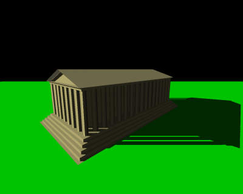
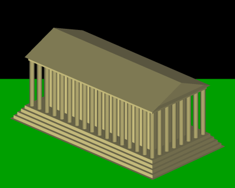
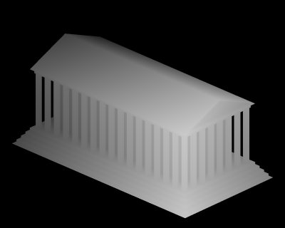
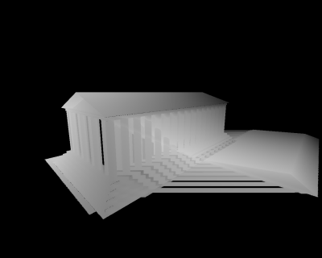
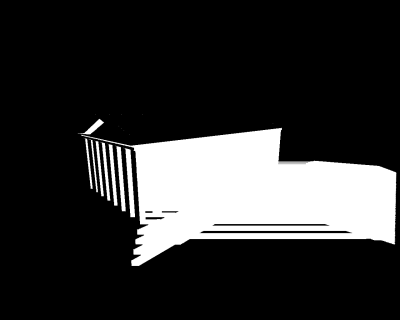

# Shadow Mapping with Vulkan

This guide provides a detailed walkthrough of implementing shadow mapping in Vulkan. Shadow mapping is a technique used to create realistic shadows in 3D scenes by rendering the scene from the light's perspective and using that information to determine which areas are in shadow.



You can have a conceptual presentation of shadow mapping here: https://en.wikipedia.org/wiki/Shadow_mapping

## Table of Contents

1. [Introduction to Shadow Mapping](#introduction-to-shadow-mapping)
2. [Shadow Mapping Pipeline Overview](#shadow-mapping-pipeline-overview)
3. [Setting Up the Shadow Map Framebuffer](#setting-up-the-shadow-map-framebuffer)
4. [Creating the Shadow Map Render Pass](#creating-the-shadow-map-render-pass)
5. [Shadow Map Generation](#shadow-map-generation)
6. [Sampling the Shadow Map](#sampling-the-shadow-map)
7. [Handling Shadow Mapping Artifacts](#handling-shadow-mapping-artifacts)
8. [PCF Filtering for Soft Shadows](#pcf-filtering-for-soft-shadows)
9. [Visualization and Debugging](#visualization-and-debugging)
10. [Putting It All Together](#putting-it-all-together)

## Introduction to Shadow Mapping

Shadow mapping is a two-pass rendering technique:

1. **Shadow Pass**: The scene is rendered from the light's point of view, storing depth information in a texture (the shadow map that give its name to this technique).

 

2. **Rendering Pass**: The scene is rendered from the camera's point of view, using the shadow map to determine whether fragments are in shadow.

 

The basic principle is simple: if a fragment's depth when viewed from the light is greater than the value stored in the shadow map, it means something is between the light and that fragment, so the fragment is in shadow.




## Class and strutcs

First, we will define the variables we need:

```cpp
class VulkanExample : public VulkanExampleBase
{
public:
	bool displayShadowMap = false;
	bool filterPCF = true;

	// Keep depth range as small as possible
	// for better shadow map precision
	float zNear = 1.0f;
	float zFar = 96.0f;

	// Depth bias (and slope) are used to avoid shadowing artifacts
	// Constant depth bias factor (always applied)
	float depthBiasConstant = 1.25f;
	// Slope depth bias factor, applied depending on polygon's slope
	float depthBiasSlope = 1.75f;

	glm::vec3 lightPos = glm::vec3();
	float lightFOV = 45.0f;

	std::vector<vkglTF::Model> scenes;
	std::vector<std::string> sceneNames;
	int32_t sceneIndex = 0;

	struct UniformDataScene {
		glm::mat4 projection;
		glm::mat4 view;
		glm::mat4 model;
		glm::mat4 depthBiasMVP;
		glm::vec4 lightPos;
		// Used for depth map visualization
		float zNear;
		float zFar;
	} uniformDataScene;

	struct UniformDataOffscreen {
		glm::mat4 depthMVP;
	} uniformDataOffscreen;

	struct {
		vks::Buffer scene;
		vks::Buffer offscreen;
	} uniformBuffers;

	struct {
		VkPipeline offscreen{ VK_NULL_HANDLE };
		VkPipeline sceneShadow{ VK_NULL_HANDLE };
		// Pipeline with percentage close filtering (PCF) of the shadow map 
		VkPipeline sceneShadowPCF{ VK_NULL_HANDLE };
		VkPipeline debug{ VK_NULL_HANDLE };
	} pipelines;
	VkPipelineLayout pipelineLayout{ VK_NULL_HANDLE };

	struct {
		VkDescriptorSet offscreen{ VK_NULL_HANDLE };
		VkDescriptorSet scene{ VK_NULL_HANDLE };
		VkDescriptorSet debug{ VK_NULL_HANDLE };
	} descriptorSets;
	VkDescriptorSetLayout descriptorSetLayout{ VK_NULL_HANDLE };

	// Framebuffer for offscreen rendering
	struct FrameBufferAttachment {
		VkImage image;
		VkDeviceMemory mem;
		VkImageView view;
	};

	struct OffscreenPass {
		int32_t width, height;
		VkFramebuffer frameBuffer;
		FrameBufferAttachment depth;
		VkRenderPass renderPass;
		VkSampler depthSampler;
		VkDescriptorImageInfo descriptor;
	} offscreenPass{};
    ...
```

## Shadow Mapping Pipeline Overview

In our implementation, the shadow mapping process consists of the following steps:

```cpp
    void buildCommandBuffers()
    {
        VkCommandBufferBeginInfo cmdBufInfo = vks::initializers::commandBufferBeginInfo();

        VkClearValue clearValues[2];
        VkViewport viewport;
        VkRect2D scissor;

        for (int32_t i = 0; i < drawCmdBuffers.size(); ++i)
        {
            VK_CHECK_RESULT(vkBeginCommandBuffer(drawCmdBuffers[i], &cmdBufInfo));

            // First render pass: Generate shadow map by rendering the scene from light's POV
            {
                clearValues[0].depthStencil = { 1.0f, 0 };

                VkRenderPassBeginInfo renderPassBeginInfo = vks::initializers::renderPassBeginInfo();
                renderPassBeginInfo.renderPass = offscreenPass.renderPass;
                renderPassBeginInfo.framebuffer = offscreenPass.frameBuffer;
                renderPassBeginInfo.renderArea.extent.width = offscreenPass.width;
                renderPassBeginInfo.renderArea.extent.height = offscreenPass.height;
                renderPassBeginInfo.clearValueCount = 1;
                renderPassBeginInfo.pClearValues = clearValues;

                // Render to offscreen frame buffer
                vkCmdBeginRenderPass(drawCmdBuffers[i], &renderPassBeginInfo, VK_SUBPASS_CONTENTS_INLINE);

                viewport = vks::initializers::viewport((float)offscreenPass.width, (float)offscreenPass.height, 0.0f, 1.0f);
                vkCmdSetViewport(drawCmdBuffers[i], 0, 1, &viewport);

                scissor = vks::initializers::rect2D(offscreenPass.width, offscreenPass.height, 0, 0);
                vkCmdSetScissor(drawCmdBuffers[i], 0, 1, &scissor);

                // Set depth bias (aka "Polygon offset")
                // Required to avoid shadow mapping artifacts
                vkCmdSetDepthBias(
                    drawCmdBuffers[i],
                    depthBiasConstant,
                    0.0f,
                    depthBiasSlope);

                vkCmdBindPipeline(drawCmdBuffers[i], VK_PIPELINE_BIND_POINT_GRAPHICS, pipelines.offscreen);
                vkCmdBindDescriptorSets(drawCmdBuffers[i], VK_PIPELINE_BIND_POINT_GRAPHICS, pipelineLayout, 0, 1, &descriptorSets.offscreen, 0, nullptr);
                scenes[sceneIndex].draw(drawCmdBuffers[i]);

                vkCmdEndRenderPass(drawCmdBuffers[i]);
            }

            /*
            Note: Explicit synchronization is not required between the render pass, as this is done implicit via sub pass dependencies
            */

            // Second pass: Scene rendering with applied shadow map
            {
                clearValues[0].color = defaultClearColor;
                clearValues[1].depthStencil = { 1.0f, 0 };

                VkRenderPassBeginInfo renderPassBeginInfo = vks::initializers::renderPassBeginInfo();
                renderPassBeginInfo.renderPass = renderPass;
                renderPassBeginInfo.framebuffer = frameBuffers[i];
                renderPassBeginInfo.renderArea.extent.width = width;
                renderPassBeginInfo.renderArea.extent.height = height;
                renderPassBeginInfo.clearValueCount = 2;
                renderPassBeginInfo.pClearValues = clearValues;

                vkCmdBeginRenderPass(drawCmdBuffers[i], &renderPassBeginInfo, VK_SUBPASS_CONTENTS_INLINE);

                viewport = vks::initializers::viewport((float)width, (float)height, 0.0f, 1.0f);
                vkCmdSetViewport(drawCmdBuffers[i], 0, 1, &viewport);

                scissor = vks::initializers::rect2D(width, height, 0, 0);
                vkCmdSetScissor(drawCmdBuffers[i], 0, 1, &scissor);

                // Visualize shadow map
                if (displayShadowMap) {
                    vkCmdBindDescriptorSets(drawCmdBuffers[i], VK_PIPELINE_BIND_POINT_GRAPHICS, pipelineLayout, 0, 1, &descriptorSets.debug, 0, nullptr);
                    vkCmdBindPipeline(drawCmdBuffers[i], VK_PIPELINE_BIND_POINT_GRAPHICS, pipelines.debug);
                    vkCmdDraw(drawCmdBuffers[i], 3, 1, 0, 0);
                } else {
                    // Render the shadows scene (with or percentage-closer filtering (PCF))
                    vkCmdBindDescriptorSets(drawCmdBuffers[i], VK_PIPELINE_BIND_POINT_GRAPHICS, pipelineLayout, 0, 1, &descriptorSets.scene, 0, nullptr);
                    vkCmdBindPipeline(drawCmdBuffers[i], VK_PIPELINE_BIND_POINT_GRAPHICS, (filterPCF) ? pipelines.sceneShadowPCF : pipelines.sceneShadow);
                    scenes[sceneIndex].draw(drawCmdBuffers[i]);
                }

                drawUI(drawCmdBuffers[i]);

                vkCmdEndRenderPass(drawCmdBuffers[i]);
            }

            VK_CHECK_RESULT(vkEndCommandBuffer(drawCmdBuffers[i]));
        }
    }
```

Let's break down each step of the implementation in detail.

## Preparation

We'll prepare our rendering architecture. We'll start by casting light on what concerns the shadows, then check the rest of the preparation.

### Shadow map preparation

#### Setting up the Shadow Map Framebuffer

To create a shadow map, we need an offscreen framebuffer with a depth attachment.

Key points:
- We will use a dedicated depth format (`VK_FORMAT_D16_UNORM`) which offers good precision for our shadow map
- The image will have `VK_IMAGE_USAGE_SAMPLED_BIT` flag so we can sample it in the shader later
- The shadow map size is defined by `shadowMapize` (2048x2048 by default, 1024x1024 on Android)


```cpp
    // 16 bits of depth is enough for such a small scene
    const VkFormat offscreenDepthFormat{ VK_FORMAT_D16_UNORM };

    // Shadow map dimension
    const uint32_t shadowMapize{ 2048 };

    // Setup the offscreen framebuffer for rendering the scene from light's point-of-view to
    // The depth attachment of this framebuffer will then be used to sample from in the fragment shader of the shadowing pass
    void prepareOffscreenFramebuffer()
    {
        offscreenPass.width = shadowMapize;
        offscreenPass.height = shadowMapize;

        // For shadow mapping we only need a depth attachment
        VkImageCreateInfo image = vks::initializers::imageCreateInfo();
        image.imageType = VK_IMAGE_TYPE_2D;
        image.extent.width = offscreenPass.width;
        image.extent.height = offscreenPass.height;
        image.extent.depth = 1;
        image.mipLevels = 1;
        image.arrayLayers = 1;
        image.samples = VK_SAMPLE_COUNT_1_BIT;
        image.tiling = VK_IMAGE_TILING_OPTIMAL;
        // Depth stencil attachment
        image.format = offscreenDepthFormat;
        // We will sample directly from the depth attachment for the shadow mapping														
        image.usage = VK_IMAGE_USAGE_DEPTH_STENCIL_ATTACHMENT_BIT | VK_IMAGE_USAGE_SAMPLED_BIT;		
        VK_CHECK_RESULT(vkCreateImage(device, &image, nullptr, &offscreenPass.depth.image));

        VkMemoryAllocateInfo memAlloc = vks::initializers::memoryAllocateInfo();
        VkMemoryRequirements memReqs;
        vkGetImageMemoryRequirements(device, offscreenPass.depth.image, &memReqs);
        memAlloc.allocationSize = memReqs.size;
        memAlloc.memoryTypeIndex = vulkanDevice->getMemoryType(memReqs.memoryTypeBits, VK_MEMORY_PROPERTY_DEVICE_LOCAL_BIT);
        VK_CHECK_RESULT(vkAllocateMemory(device, &memAlloc, nullptr, &offscreenPass.depth.mem));
        VK_CHECK_RESULT(vkBindImageMemory(device, offscreenPass.depth.image, offscreenPass.depth.mem, 0));

        VkImageViewCreateInfo depthStencilView = vks::initializers::imageViewCreateInfo();
        depthStencilView.viewType = VK_IMAGE_VIEW_TYPE_2D;
        depthStencilView.format = offscreenDepthFormat;
        depthStencilView.subresourceRange = {};
        depthStencilView.subresourceRange.aspectMask = VK_IMAGE_ASPECT_DEPTH_BIT;
        depthStencilView.subresourceRange.baseMipLevel = 0;
        depthStencilView.subresourceRange.levelCount = 1;
        depthStencilView.subresourceRange.baseArrayLayer = 0;
        depthStencilView.subresourceRange.layerCount = 1;
        depthStencilView.image = offscreenPass.depth.image;
        VK_CHECK_RESULT(vkCreateImageView(device, &depthStencilView, nullptr, &offscreenPass.depth.view));

        // Create sampler to sample from to depth attachment
        // Used to sample in the fragment shader for shadowed rendering
        VkFilter shadowmap_filter = vks::tools::formatIsFilterable(physicalDevice, offscreenDepthFormat, VK_IMAGE_TILING_OPTIMAL) ? VK_FILTER_LINEAR : VK_FILTER_NEAREST;
        VkSamplerCreateInfo sampler = vks::initializers::samplerCreateInfo();
        sampler.magFilter = shadowmap_filter;
        sampler.minFilter = shadowmap_filter;
        sampler.mipmapMode = VK_SAMPLER_MIPMAP_MODE_LINEAR;
        sampler.addressModeU = VK_SAMPLER_ADDRESS_MODE_CLAMP_TO_EDGE;
        sampler.addressModeV = sampler.addressModeU;
        sampler.addressModeW = sampler.addressModeU;
        sampler.mipLodBias = 0.0f;
        sampler.maxAnisotropy = 1.0f;
        sampler.minLod = 0.0f;
        sampler.maxLod = 1.0f;
        sampler.borderColor = VK_BORDER_COLOR_FLOAT_OPAQUE_WHITE;
        VK_CHECK_RESULT(vkCreateSampler(device, &sampler, nullptr, &offscreenPass.depthSampler));

        prepareOffscreenRenderpass();

        // Create frame buffer
        VkFramebufferCreateInfo fbufCreateInfo = vks::initializers::framebufferCreateInfo();
        fbufCreateInfo.renderPass = offscreenPass.renderPass;
        fbufCreateInfo.attachmentCount = 1;
        fbufCreateInfo.pAttachments = &offscreenPass.depth.view;
        fbufCreateInfo.width = offscreenPass.width;
        fbufCreateInfo.height = offscreenPass.height;
        fbufCreateInfo.layers = 1;

        VK_CHECK_RESULT(vkCreateFramebuffer(device, &fbufCreateInfo, nullptr, &offscreenPass.frameBuffer));
    }
```

#### Creating the Shadow Map Render Pass

We need a specialized render pass for shadow map generation that only uses a depth attachment:

```cpp
void prepareOffscreenRenderpass()
{
    VkAttachmentDescription attachmentDescription{};
    attachmentDescription.format = offscreenDepthFormat;
    attachmentDescription.samples = VK_SAMPLE_COUNT_1_BIT;
    // Clear depth at beginning of the render pass
    attachmentDescription.loadOp = VK_ATTACHMENT_LOAD_OP_CLEAR;		
    // We will read from depth, so it's important to store the depth attachment results					
    attachmentDescription.storeOp = VK_ATTACHMENT_STORE_OP_STORE;
    attachmentDescription.stencilLoadOp = VK_ATTACHMENT_LOAD_OP_DONT_CARE;
    attachmentDescription.stencilStoreOp = VK_ATTACHMENT_STORE_OP_DONT_CARE;
    // We don't care about initial layout of the attachment
    attachmentDescription.initialLayout = VK_IMAGE_LAYOUT_UNDEFINED;
    // Attachment will be transitioned to shader read at render pass end
    attachmentDescription.finalLayout = VK_IMAGE_LAYOUT_DEPTH_STENCIL_READ_ONLY_OPTIMAL;

    VkAttachmentReference depthReference = {};
    depthReference.attachment = 0;
    // Attachment will be used as depth/stencil during render pass
    depthReference.layout = VK_IMAGE_LAYOUT_DEPTH_STENCIL_ATTACHMENT_OPTIMAL;			

    VkSubpassDescription subpass = {};
    subpass.pipelineBindPoint = VK_PIPELINE_BIND_POINT_GRAPHICS;
    // No color attachments
    subpass.colorAttachmentCount = 0;													
    // Reference to our depth attachment
    subpass.pDepthStencilAttachment = &depthReference;									

    // Use subpass dependencies for layout transitions
    std::array<VkSubpassDependency, 2> dependencies;

    dependencies[0].srcSubpass = VK_SUBPASS_EXTERNAL;
    dependencies[0].dstSubpass = 0;
    dependencies[0].srcStageMask = VK_PIPELINE_STAGE_FRAGMENT_SHADER_BIT;
    dependencies[0].dstStageMask = VK_PIPELINE_STAGE_EARLY_FRAGMENT_TESTS_BIT;
    dependencies[0].srcAccessMask = VK_ACCESS_SHADER_READ_BIT;
    dependencies[0].dstAccessMask = VK_ACCESS_DEPTH_STENCIL_ATTACHMENT_WRITE_BIT;
    dependencies[0].dependencyFlags = VK_DEPENDENCY_BY_REGION_BIT;

    dependencies[1].srcSubpass = 0;
    dependencies[1].dstSubpass = VK_SUBPASS_EXTERNAL;
    dependencies[1].srcStageMask = VK_PIPELINE_STAGE_LATE_FRAGMENT_TESTS_BIT;
    dependencies[1].dstStageMask = VK_PIPELINE_STAGE_FRAGMENT_SHADER_BIT;
    dependencies[1].srcAccessMask = VK_ACCESS_DEPTH_STENCIL_ATTACHMENT_WRITE_BIT;
    dependencies[1].dstAccessMask = VK_ACCESS_SHADER_READ_BIT;
    dependencies[1].dependencyFlags = VK_DEPENDENCY_BY_REGION_BIT;

    VkRenderPassCreateInfo renderPassCreateInfo = vks::initializers::renderPassCreateInfo();
    renderPassCreateInfo.attachmentCount = 1;
    renderPassCreateInfo.pAttachments = &attachmentDescription;
    renderPassCreateInfo.subpassCount = 1;
    renderPassCreateInfo.pSubpasses = &subpass;
    renderPassCreateInfo.dependencyCount = static_cast<uint32_t>(dependencies.size());
    renderPassCreateInfo.pDependencies = dependencies.data();

    VK_CHECK_RESULT(vkCreateRenderPass(device, &renderPassCreateInfo, nullptr, &offscreenPass.renderPass));
}
```

Important aspects:
- The render pass only has a depth attachment (no color attachments)
- The depth attachment's final layout is `VK_IMAGE_LAYOUT_DEPTH_STENCIL_READ_ONLY_OPTIMAL` so it can be sampled in the fragment shader
- We use subpass dependencies to handle layout transitions

#### Pipeline for shadow mapping

The pipeline for shadow map generation has those key characteristics. It:
- Uses only a vertex shader (no fragment shader needed)
- Disables backface culling to capture all geometry
- Enables depth bias to prevent shadow acne
- Uses a dynamic depth bias so it can be adjusted at runtime

```cpp
// Inside preparePipelines() method

// Offscreen pipeline (vertex shader only)
shaderStages[0] = loadShader(getShadersPath() + "shadowmapping/offscreen.vert.spv", VK_SHADER_STAGE_VERTEX_BIT);
pipelineCI.stageCount = 1;  // Only vertex shader is needed
// No blend attachment states (no color attachments used)
colorBlendStateCI.attachmentCount = 0;
// Disable culling, so all faces contribute to shadows
rasterizationStateCI.cullMode = VK_CULL_MODE_NONE;
depthStencilStateCI.depthCompareOp = VK_COMPARE_OP_LESS_OR_EQUAL;
// Enable depth bias
rasterizationStateCI.depthBiasEnable = VK_TRUE;
// Add depth bias to dynamic state
dynamicStateEnables.push_back(VK_DYNAMIC_STATE_DEPTH_BIAS);
dynamicStateCI = vks::initializers::pipelineDynamicStateCreateInfo(dynamicStateEnables);

pipelineCI.renderPass = offscreenPass.renderPass;
VK_CHECK_RESULT(vkCreateGraphicsPipelines(device, pipelineCache, 1, &pipelineCI, nullptr, &pipelines.offscreen));
```


#### Shadow Map Generation shader

To generate the shadow map, we need a vertex shader that transforms vertices into light space:

`offscreen.vert`
```glsl
#version 450

layout (location = 0) in vec3 inPos;

layout (binding = 0) uniform UBO 
{
    mat4 depthMVP;
} ubo;

out gl_PerVertex 
{
    vec4 gl_Position;   
};

void main()
{
    gl_Position = ubo.depthMVP * vec4(inPos, 1.0);
}
```

The fragment shader will be the simplest possible:

`offscreen.frag`
```glsl
#version 450

layout(location = 0) out vec4 color;

void main() 
{	
	color = vec4(1.0, 0.0, 0.0, 1.0);
}
```

### Rest of the preparation

#### Preparation function

The `prepare()` function will prepare everything needed for this scene.

```cpp
	void prepare()
	{
		VulkanExampleBase::prepare();
		loadAssets();
		prepareOffscreenFramebuffer();
		prepareUniformBuffers();
		setupDescriptors();
		preparePipelines();
		buildCommandBuffers();
		prepared = true;
	}

    void loadAssets()
	{
		const uint32_t glTFLoadingFlags = vkglTF::FileLoadingFlags::PreTransformVertices | vkglTF::FileLoadingFlags::PreMultiplyVertexColors | vkglTF::FileLoadingFlags::FlipY;
		scenes.resize(2);
		scenes[0].loadFromFile(getAssetPath() + "models/vulkanscene_shadow.gltf", vulkanDevice, queue, glTFLoadingFlags);
		scenes[1].loadFromFile(getAssetPath() + "models/samplescene.gltf", vulkanDevice, queue, glTFLoadingFlags);
		sceneNames = {"Vulkan scene", "Teapots and pillars" };
	}

    // Prepare and initialize uniform buffer containing shader uniforms
	void prepareUniformBuffers()
	{
		// Offscreen vertex shader uniform buffer block
		VK_CHECK_RESULT(vulkanDevice->createBuffer(VK_BUFFER_USAGE_UNIFORM_BUFFER_BIT, VK_MEMORY_PROPERTY_HOST_VISIBLE_BIT | VK_MEMORY_PROPERTY_HOST_COHERENT_BIT, &uniformBuffers.offscreen, sizeof(UniformDataOffscreen)));
		// Scene vertex shader uniform buffer block
		VK_CHECK_RESULT(vulkanDevice->createBuffer(VK_BUFFER_USAGE_UNIFORM_BUFFER_BIT, VK_MEMORY_PROPERTY_HOST_VISIBLE_BIT | VK_MEMORY_PROPERTY_HOST_COHERENT_BIT, &uniformBuffers.scene, sizeof(UniformDataScene)));
		// Map persistent
		VK_CHECK_RESULT(uniformBuffers.offscreen.map());
		VK_CHECK_RESULT(uniformBuffers.scene.map());

		updateLight();
		updateUniformBufferOffscreen();
		updateUniformBuffers();
	}

	void setupDescriptors()
	{
		// Pool
		std::vector<VkDescriptorPoolSize> poolSizes = {
			vks::initializers::descriptorPoolSize(VK_DESCRIPTOR_TYPE_UNIFORM_BUFFER, 3),
			vks::initializers::descriptorPoolSize(VK_DESCRIPTOR_TYPE_COMBINED_IMAGE_SAMPLER, 3)
		};
		VkDescriptorPoolCreateInfo descriptorPoolInfo = vks::initializers::descriptorPoolCreateInfo(poolSizes, 3);
		VK_CHECK_RESULT(vkCreateDescriptorPool(device, &descriptorPoolInfo, nullptr, &descriptorPool));

		// Layout
		std::vector<VkDescriptorSetLayoutBinding> setLayoutBindings = {
			// Binding 0 : Vertex shader uniform buffer
			vks::initializers::descriptorSetLayoutBinding(VK_DESCRIPTOR_TYPE_UNIFORM_BUFFER, VK_SHADER_STAGE_VERTEX_BIT | VK_SHADER_STAGE_FRAGMENT_BIT, 0),
			// Binding 1 : Fragment shader image sampler (shadow map)
			vks::initializers::descriptorSetLayoutBinding(VK_DESCRIPTOR_TYPE_COMBINED_IMAGE_SAMPLER, VK_SHADER_STAGE_FRAGMENT_BIT, 1)
		};
		VkDescriptorSetLayoutCreateInfo descriptorLayout = vks::initializers::descriptorSetLayoutCreateInfo(setLayoutBindings);
		VK_CHECK_RESULT(vkCreateDescriptorSetLayout(device, &descriptorLayout, nullptr, &descriptorSetLayout));

		// Sets
		std::vector<VkWriteDescriptorSet> writeDescriptorSets;

		// Image descriptor for the shadow map attachment
		VkDescriptorImageInfo shadowMapDescriptor =
			vks::initializers::descriptorImageInfo(
				offscreenPass.depthSampler,
				offscreenPass.depth.view,
				VK_IMAGE_LAYOUT_DEPTH_STENCIL_READ_ONLY_OPTIMAL);

		// Debug display
		VkDescriptorSetAllocateInfo allocInfo = vks::initializers::descriptorSetAllocateInfo(descriptorPool, &descriptorSetLayout, 1);
		VK_CHECK_RESULT(vkAllocateDescriptorSets(device, &allocInfo, &descriptorSets.debug));
		writeDescriptorSets = {
			// Binding 0 : Parameters uniform buffer
			vks::initializers::writeDescriptorSet(descriptorSets.debug, VK_DESCRIPTOR_TYPE_UNIFORM_BUFFER, 0, &uniformBuffers.scene.descriptor),
			// Binding 1 : Fragment shader texture sampler
			vks::initializers::writeDescriptorSet(descriptorSets.debug, VK_DESCRIPTOR_TYPE_COMBINED_IMAGE_SAMPLER, 1, &shadowMapDescriptor)
		};
		vkUpdateDescriptorSets(device, static_cast<uint32_t>(writeDescriptorSets.size()), writeDescriptorSets.data(), 0, nullptr);

		// Offscreen shadow map generation
		VK_CHECK_RESULT(vkAllocateDescriptorSets(device, &allocInfo, &descriptorSets.offscreen));
		writeDescriptorSets = {
			// Binding 0 : Vertex shader uniform buffer
			vks::initializers::writeDescriptorSet(descriptorSets.offscreen, VK_DESCRIPTOR_TYPE_UNIFORM_BUFFER, 0, &uniformBuffers.offscreen.descriptor),
		};
		vkUpdateDescriptorSets(device, static_cast<uint32_t>(writeDescriptorSets.size()), writeDescriptorSets.data(), 0, nullptr);

		// Scene rendering with shadow map applied
		VK_CHECK_RESULT(vkAllocateDescriptorSets(device, &allocInfo, &descriptorSets.scene));
		writeDescriptorSets = {
			// Binding 0 : Vertex shader uniform buffer
			vks::initializers::writeDescriptorSet(descriptorSets.scene, VK_DESCRIPTOR_TYPE_UNIFORM_BUFFER, 0, &uniformBuffers.scene.descriptor),
			// Binding 1 : Fragment shader shadow sampler
			vks::initializers::writeDescriptorSet(descriptorSets.scene, VK_DESCRIPTOR_TYPE_COMBINED_IMAGE_SAMPLER, 1, &shadowMapDescriptor)
		};
		vkUpdateDescriptorSets(device, static_cast<uint32_t>(writeDescriptorSets.size()), writeDescriptorSets.data(), 0, nullptr);
	}

	void preparePipelines()
	{
		// Layout
		VkPipelineLayoutCreateInfo pipelineLayoutCreateInfo = vks::initializers::pipelineLayoutCreateInfo(&descriptorSetLayout, 1);
		VK_CHECK_RESULT(vkCreatePipelineLayout(device, &pipelineLayoutCreateInfo, nullptr, &pipelineLayout));

		// Pipelines
		VkPipelineInputAssemblyStateCreateInfo inputAssemblyStateCI = vks::initializers::pipelineInputAssemblyStateCreateInfo(VK_PRIMITIVE_TOPOLOGY_TRIANGLE_LIST, 0, VK_FALSE);
		VkPipelineRasterizationStateCreateInfo rasterizationStateCI = vks::initializers::pipelineRasterizationStateCreateInfo(VK_POLYGON_MODE_FILL, VK_CULL_MODE_BACK_BIT, VK_FRONT_FACE_COUNTER_CLOCKWISE, 0);
		VkPipelineColorBlendAttachmentState blendAttachmentState = vks::initializers::pipelineColorBlendAttachmentState(0xf, VK_FALSE);
		VkPipelineColorBlendStateCreateInfo colorBlendStateCI = vks::initializers::pipelineColorBlendStateCreateInfo(1, &blendAttachmentState);
		VkPipelineDepthStencilStateCreateInfo depthStencilStateCI = vks::initializers::pipelineDepthStencilStateCreateInfo(VK_TRUE, VK_TRUE, VK_COMPARE_OP_LESS_OR_EQUAL);
		VkPipelineViewportStateCreateInfo viewportStateCI = vks::initializers::pipelineViewportStateCreateInfo(1, 1, 0);
		VkPipelineMultisampleStateCreateInfo multisampleStateCI = vks::initializers::pipelineMultisampleStateCreateInfo(VK_SAMPLE_COUNT_1_BIT, 0);
		std::vector<VkDynamicState> dynamicStateEnables = { VK_DYNAMIC_STATE_VIEWPORT, VK_DYNAMIC_STATE_SCISSOR };
		VkPipelineDynamicStateCreateInfo dynamicStateCI = vks::initializers::pipelineDynamicStateCreateInfo(dynamicStateEnables);
		std::array<VkPipelineShaderStageCreateInfo, 2> shaderStages;

		VkGraphicsPipelineCreateInfo pipelineCI = vks::initializers::pipelineCreateInfo(pipelineLayout, renderPass, 0);
		pipelineCI.pInputAssemblyState = &inputAssemblyStateCI;
		pipelineCI.pRasterizationState = &rasterizationStateCI;
		pipelineCI.pColorBlendState = &colorBlendStateCI;
		pipelineCI.pMultisampleState = &multisampleStateCI;
		pipelineCI.pViewportState = &viewportStateCI;
		pipelineCI.pDepthStencilState = &depthStencilStateCI;
		pipelineCI.pDynamicState = &dynamicStateCI;
		pipelineCI.stageCount = static_cast<uint32_t>(shaderStages.size());
		pipelineCI.pStages = shaderStages.data();

		// Shadow mapping debug quad display
		rasterizationStateCI.cullMode = VK_CULL_MODE_NONE;
		shaderStages[0] = loadShader(getShadersPath() + "shadowmapping/quad.vert.spv", VK_SHADER_STAGE_VERTEX_BIT);
		shaderStages[1] = loadShader(getShadersPath() + "shadowmapping/quad.frag.spv", VK_SHADER_STAGE_FRAGMENT_BIT);
		// Empty vertex input state
		VkPipelineVertexInputStateCreateInfo emptyInputState = vks::initializers::pipelineVertexInputStateCreateInfo();
		pipelineCI.pVertexInputState = &emptyInputState;
		VK_CHECK_RESULT(vkCreateGraphicsPipelines(device, pipelineCache, 1, &pipelineCI, nullptr, &pipelines.debug));

		// Scene rendering with shadows applied
		pipelineCI.pVertexInputState  = vkglTF::Vertex::getPipelineVertexInputState({vkglTF::VertexComponent::Position, vkglTF::VertexComponent::UV, vkglTF::VertexComponent::Color, vkglTF::VertexComponent::Normal});
		rasterizationStateCI.cullMode = VK_CULL_MODE_BACK_BIT;
		shaderStages[0] = loadShader(getShadersPath() + "shadowmapping/scene.vert.spv", VK_SHADER_STAGE_VERTEX_BIT);
		shaderStages[1] = loadShader(getShadersPath() + "shadowmapping/scene.frag.spv", VK_SHADER_STAGE_FRAGMENT_BIT);
		// Use specialization constants to select between horizontal and vertical blur
		uint32_t enablePCF = 0;
		VkSpecializationMapEntry specializationMapEntry = vks::initializers::specializationMapEntry(0, 0, sizeof(uint32_t));
		VkSpecializationInfo specializationInfo = vks::initializers::specializationInfo(1, &specializationMapEntry, sizeof(uint32_t), &enablePCF);
		shaderStages[1].pSpecializationInfo = &specializationInfo;
		// No filtering
		VK_CHECK_RESULT(vkCreateGraphicsPipelines(device, pipelineCache, 1, &pipelineCI, nullptr, &pipelines.sceneShadow));
		// PCF filtering
		enablePCF = 1;
		VK_CHECK_RESULT(vkCreateGraphicsPipelines(device, pipelineCache, 1, &pipelineCI, nullptr, &pipelines.sceneShadowPCF));

		// Offscreen pipeline (vertex shader only)
		shaderStages[0] = loadShader(getShadersPath() + "shadowmapping/offscreen.vert.spv", VK_SHADER_STAGE_VERTEX_BIT);
		pipelineCI.stageCount = 1;
		// No blend attachment states (no color attachments used)
		colorBlendStateCI.attachmentCount = 0;
		// Disable culling, so all faces contribute to shadows
		rasterizationStateCI.cullMode = VK_CULL_MODE_NONE;
		depthStencilStateCI.depthCompareOp = VK_COMPARE_OP_LESS_OR_EQUAL;
		// Enable depth bias
		rasterizationStateCI.depthBiasEnable = VK_TRUE;
		// Add depth bias to dynamic state, so we can change it at runtime
		dynamicStateEnables.push_back(VK_DYNAMIC_STATE_DEPTH_BIAS);
		dynamicStateCI = vks::initializers::pipelineDynamicStateCreateInfo(dynamicStateEnables);

		pipelineCI.renderPass = offscreenPass.renderPass;
		VK_CHECK_RESULT(vkCreateGraphicsPipelines(device, pipelineCache, 1, &pipelineCI, nullptr, &pipelines.offscreen));
	}
```

#### Scene construction and cleaning

By the way, we need to construct our scene, and clean it when we exit.

```cpp
    VulkanExample() : VulkanExampleBase()
    {
        title = "Projected shadow mapping";
        camera.type = Camera::CameraType::lookat;
        camera.setPosition(glm::vec3(0.0f, 0.0f, -12.5f));
        camera.setRotation(glm::vec3(-25.0f, -390.0f, 0.0f));
        camera.setPerspective(60.0f, (float)width / (float)height, 1.0f, 256.0f);
        timerSpeed *= 0.5f;
    }

    ~VulkanExample()
    {
        if (device) {
            // Frame buffer
            vkDestroySampler(device, offscreenPass.depthSampler, nullptr);

            // Depth attachment
            vkDestroyImageView(device, offscreenPass.depth.view, nullptr);
            vkDestroyImage(device, offscreenPass.depth.image, nullptr);
            vkFreeMemory(device, offscreenPass.depth.mem, nullptr);

            vkDestroyFramebuffer(device, offscreenPass.frameBuffer, nullptr);

            vkDestroyRenderPass(device, offscreenPass.renderPass, nullptr);

            vkDestroyPipeline(device, pipelines.debug, nullptr);
            vkDestroyPipeline(device, pipelines.offscreen, nullptr);
            vkDestroyPipeline(device, pipelines.sceneShadow, nullptr);
            vkDestroyPipeline(device, pipelines.sceneShadowPCF, nullptr);

            vkDestroyPipelineLayout(device, pipelineLayout, nullptr);

            vkDestroyDescriptorSetLayout(device, descriptorSetLayout, nullptr);

            // Uniform buffers
            uniformBuffers.offscreen.destroy();
            uniformBuffers.scene.destroy();
        }
    }
```

## Update

This code will both be useful in prepation and each frame:

```cpp
    void updateLight()
	{
		// Animate the light source
		lightPos.x = cos(glm::radians(timer * 360.0f)) * 40.0f;
		lightPos.y = -50.0f + sin(glm::radians(timer * 360.0f)) * 20.0f;
		lightPos.z = 25.0f + sin(glm::radians(timer * 360.0f)) * 5.0f;
	}

	void updateUniformBuffers()
	{
		uniformDataScene.projection = camera.matrices.perspective;
		uniformDataScene.view = camera.matrices.view;
		uniformDataScene.model = glm::mat4(1.0f);
		uniformDataScene.lightPos = glm::vec4(lightPos, 1.0f);
		uniformDataScene.depthBiasMVP = uniformDataOffscreen.depthMVP;
		uniformDataScene.zNear = zNear;
		uniformDataScene.zFar = zFar;
		memcpy(uniformBuffers.scene.mapped, &uniformDataScene, sizeof(uniformDataScene));
	}

	void updateUniformBufferOffscreen()
	{
		// Matrix from light's point of view
		glm::mat4 depthProjectionMatrix = glm::perspective(glm::radians(lightFOV), 1.0f, zNear, zFar);
		glm::mat4 depthViewMatrix = glm::lookAt(lightPos, glm::vec3(0.0f), glm::vec3(0, 1, 0));
		glm::mat4 depthModelMatrix = glm::mat4(1.0f);

		uniformDataOffscreen.depthMVP = depthProjectionMatrix * depthViewMatrix * depthModelMatrix;

		memcpy(uniformBuffers.offscreen.mapped, &uniformDataOffscreen, sizeof(uniformDataOffscreen));
	}
```

## Rendering

Here again, we will first deal with the explanation of shadow napping, then with the general rendering loop.

### Shadow map rendering

#### Sampling the Shadow Map

Once we have generated the shadow map, we need to sample it in the rendering pass to determine if fragments are in shadow:

Remember: we have setup the sampler and the descriptor sets for using the shadow map in shaders:

From `prepareOffscreenFramebuffer()`:
```cpp
// Create sampler for the depth attachment
VkFilter shadowmap_filter = vks::tools::formatIsFilterable(physicalDevice, offscreenDepthFormat, VK_IMAGE_TILING_OPTIMAL) 
    ? VK_FILTER_LINEAR 
    : VK_FILTER_NEAREST;
VkSamplerCreateInfo sampler = vks::initializers::samplerCreateInfo();
sampler.magFilter = shadowmap_filter;
sampler.minFilter = shadowmap_filter;
sampler.mipmapMode = VK_SAMPLER_MIPMAP_MODE_LINEAR;
sampler.addressModeU = VK_SAMPLER_ADDRESS_MODE_CLAMP_TO_EDGE;
sampler.addressModeV = sampler.addressModeU;
sampler.addressModeW = sampler.addressModeU;
sampler.mipLodBias = 0.0f;
sampler.maxAnisotropy = 1.0f;
sampler.minLod = 0.0f;
sampler.maxLod = 1.0f;
sampler.borderColor = VK_BORDER_COLOR_FLOAT_OPAQUE_WHITE;
VK_CHECK_RESULT(vkCreateSampler(device, &sampler, nullptr, &offscreenPass.depthSampler));
```

From `setupDescriptors()`:
```cpp
// Image descriptor for the shadow map attachment
VkDescriptorImageInfo shadowMapDescriptor =
    vks::initializers::descriptorImageInfo(
        offscreenPass.depthSampler,
        offscreenPass.depth.view,
        VK_IMAGE_LAYOUT_DEPTH_STENCIL_READ_ONLY_OPTIMAL);

// Scene rendering with shadow map applied
VK_CHECK_RESULT(vkAllocateDescriptorSets(device, &allocInfo, &descriptorSets.scene));
writeDescriptorSets = {
    // Binding 0: Vertex shader uniform buffer
    vks::initializers::writeDescriptorSet(descriptorSets.scene, VK_DESCRIPTOR_TYPE_UNIFORM_BUFFER, 0, &uniformBuffers.scene.descriptor),
    // Binding 1: Fragment shader shadow sampler
    vks::initializers::writeDescriptorSet(descriptorSets.scene, VK_DESCRIPTOR_TYPE_COMBINED_IMAGE_SAMPLER, 1, &shadowMapDescriptor)
};
vkUpdateDescriptorSets(device, static_cast<uint32_t>(writeDescriptorSets.size()), writeDescriptorSets.data(), 0, nullptr);
```

In the shader, we use this information to determine if a fragment is in shadow. This would happen in the scene fragment shader. The following code gives a classic shadow mapping implementation:

```glsl
// Simplified shadow mapping fragment shader logic
float ShadowCalculation(vec4 fragPosLightSpace)
{
    // Perform perspective divide
    vec3 projCoords = fragPosLightSpace.xyz / fragPosLightSpace.w;
    
    // Transform to [0,1] range
    projCoords = projCoords * 0.5 + 0.5;
    
    // Get closest depth value from light's perspective
    float closestDepth = texture(shadowMap, projCoords.xy).r; 
    
    // Get depth of current fragment from light's perspective
    float currentDepth = projCoords.z;
    
    // Check whether current frag pos is in shadow
    float shadow = currentDepth > closestDepth ? 1.0 : 0.0;

    return shadow;
}
```


#### PCF Filtering for Soft Shadows

Percentage-Closer Filtering (PCF) softens shadow edges by sampling the shadow map multiple times around the fragment's position:

From `preparePipelines()`:
```cpp
// Use specialization constants to select between shadow filtering methods
uint32_t enablePCF = 0;
VkSpecializationMapEntry specializationMapEntry = vks::initializers::specializationMapEntry(0, 0, sizeof(uint32_t));
VkSpecializationInfo specializationInfo = vks::initializers::specializationInfo(1, &specializationMapEntry, sizeof(uint32_t), &enablePCF);
shaderStages[1].pSpecializationInfo = &specializationInfo;
// No filtering
VK_CHECK_RESULT(vkCreateGraphicsPipelines(device, pipelineCache, 1, &pipelineCI, nullptr, &pipelines.sceneShadow));
// PCF filtering
enablePCF = 1;
VK_CHECK_RESULT(vkCreateGraphicsPipelines(device, pipelineCache, 1, &pipelineCI, nullptr, &pipelines.sceneShadowPCF));
```

In the fragment shader, PCF would follow an algorithm like this:

```glsl
// PCF shadow calculation
float ShadowCalculationPCF(vec4 fragPosLightSpace)
{
    // Perform perspective divide
    vec3 projCoords = fragPosLightSpace.xyz / fragPosLightSpace.w;
    
    // Transform to [0,1] range
    projCoords = projCoords * 0.5 + 0.5;
    
    // Get depth of current fragment from light's perspective
    float currentDepth = projCoords.z;
    
    // PCF
    float shadow = 0.0;
    vec2 texelSize = 1.0 / textureSize(shadowMap, 0);
    for(int x = -1; x <= 1; ++x)
    {
        for(int y = -1; y <= 1; ++y)
        {
            float pcfDepth = texture(shadowMap, projCoords.xy + vec2(x, y) * texelSize).r; 
            shadow += currentDepth > pcfDepth ? 1.0 : 0.0;        
        }    
    }
    shadow /= 9.0;
    
    return shadow;
}
```

#### Actual shader implementation

Our actual code will be a little more complex:

`scene.vert`
```glsl
#version 450

layout (location = 0) in vec3 inPos;
layout (location = 1) in vec2 inUV;
layout (location = 2) in vec3 inColor;
layout (location = 3) in vec3 inNormal;

layout (binding = 0) uniform UBO 
{
	mat4 projection;
	mat4 view;
	mat4 model;
	mat4 lightSpace;
	vec4 lightPos;
	float zNear;
	float zFar;
} ubo;

layout (location = 0) out vec3 outNormal;
layout (location = 1) out vec3 outColor;
layout (location = 2) out vec3 outViewVec;
layout (location = 3) out vec3 outLightVec;
layout (location = 4) out vec4 outShadowCoord;

const mat4 biasMat = mat4( 
	0.5, 0.0, 0.0, 0.0,
	0.0, 0.5, 0.0, 0.0,
	0.0, 0.0, 1.0, 0.0,
	0.5, 0.5, 0.0, 1.0 );

void main() 
{
	outColor = inColor;
	outNormal = inNormal;

	gl_Position = ubo.projection * ubo.view * ubo.model * vec4(inPos.xyz, 1.0);
	
    vec4 pos = ubo.model * vec4(inPos, 1.0);
    outNormal = mat3(ubo.model) * inNormal;
    outLightVec = normalize(ubo.lightPos.xyz - inPos);
    outViewVec = -pos.xyz;			

	outShadowCoord = ( biasMat * ubo.lightSpace * ubo.model ) * vec4(inPos, 1.0);	
}
```

`scene.frag`
```glsl
#version 450

layout (binding = 1) uniform sampler2D shadowMap;

layout (location = 0) in vec3 inNormal;
layout (location = 1) in vec3 inColor;
layout (location = 2) in vec3 inViewVec;
layout (location = 3) in vec3 inLightVec;
layout (location = 4) in vec4 inShadowCoord;

layout (constant_id = 0) const int enablePCF = 0;

layout (location = 0) out vec4 outFragColor;

#define ambient 0.1

float textureProj(vec4 shadowCoord, vec2 off)
{
	float shadow = 1.0;
	if ( shadowCoord.z > -1.0 && shadowCoord.z < 1.0 ) 
	{
		float dist = texture( shadowMap, shadowCoord.st + off ).r;
		if ( shadowCoord.w > 0.0 && dist < shadowCoord.z ) 
		{
			shadow = ambient;
		}
	}
	return shadow;
}

float filterPCF(vec4 sc)
{
	ivec2 texDim = textureSize(shadowMap, 0);
	float scale = 1.5;
	float dx = scale * 1.0 / float(texDim.x);
	float dy = scale * 1.0 / float(texDim.y);

	float shadowFactor = 0.0;
	int count = 0;
	int range = 1;
	
	for (int x = -range; x <= range; x++)
	{
		for (int y = -range; y <= range; y++)
		{
			shadowFactor += textureProj(sc, vec2(dx*x, dy*y));
			count++;
		}
	
	}
	return shadowFactor / count;
}

void main() 
{	
	float shadow = (enablePCF == 1) ? filterPCF(inShadowCoord / inShadowCoord.w) : textureProj(inShadowCoord / inShadowCoord.w, vec2(0.0));

	vec3 N = normalize(inNormal);
	vec3 L = normalize(inLightVec);
	vec3 V = normalize(inViewVec);
	vec3 R = normalize(-reflect(L, N));
	vec3 diffuse = max(dot(N, L), ambient) * inColor;

	outFragColor = vec4(diffuse * shadow, 1.0);

}
```

#### Handling Shadow Mapping Artifacts

Shadow mapping can suffer from artifacts like shadow acne and peter panning. To combat these, we have implemented depth bias:

From `buildCommandBuffers()`:
```cpp
// Depth bias (and slope) are used to avoid shadowing artifacts
// Constant depth bias factor (always applied)
float depthBiasConstant = 1.25f;
// Slope depth bias factor, applied depending on polygon's slope
float depthBiasSlope = 1.75f;

// When rendering the shadow map, apply the bias
vkCmdSetDepthBias(
    drawCmdBuffers[i],
    depthBiasConstant,
    0.0f,
    depthBiasSlope);
```

This performs two types of bias:
1. Constant bias: Add a fixed value to every depth
2. Slope bias: Add a value proportional to the depth slope (derivative)

### Rendering loop

Our call to render is straightforward:

```cpp
	void draw()
	{
		VulkanExampleBase::prepareFrame();
		submitInfo.commandBufferCount = 1;
		submitInfo.pCommandBuffers = &drawCmdBuffers[currentBuffer];
		VK_CHECK_RESULT(vkQueueSubmit(queue, 1, &submitInfo, VK_NULL_HANDLE));
		VulkanExampleBase::submitFrame();
	}

	virtual void render()
	{
		if (!prepared)
			return;
		if (!paused || camera.updated) {
			updateLight();
			updateUniformBufferOffscreen();
			updateUniformBuffers();
		}
		draw();
	}
```


## Visualization and Debugging

For debugging, we include a way to visualize the shadow map:

From `preparePipelines()`:
```cpp
// Shadow mapping debug quad display
rasterizationStateCI.cullMode = VK_CULL_MODE_NONE;
shaderStages[0] = loadShader(getShadersPath() + "shadowmapping/quad.vert.spv", VK_SHADER_STAGE_VERTEX_BIT);
shaderStages[1] = loadShader(getShadersPath() + "shadowmapping/quad.frag.spv", VK_SHADER_STAGE_FRAGMENT_BIT);
// Empty vertex input state
VkPipelineVertexInputStateCreateInfo emptyInputState = vks::initializers::pipelineVertexInputStateCreateInfo();
pipelineCI.pVertexInputState = &emptyInputState;
VK_CHECK_RESULT(vkCreateGraphicsPipelines(device, pipelineCache, 1, &pipelineCI, nullptr, &pipelines.debug));
```

The fragment shader for shadow map visualization linearizes the depth for better visibility:

`quad.vert`
```glsl
#version 450

layout (location = 0) out vec2 outUV;

void main() 
{
	outUV = vec2((gl_VertexIndex << 1) & 2, gl_VertexIndex & 2);
	gl_Position = vec4(outUV * 2.0f - 1.0f, 0.0f, 1.0f);
}
```

`quad.frag`
```glsl
#version 450

layout (binding = 1) uniform sampler2D samplerColor;

layout (location = 0) in vec2 inUV;

layout (location = 0) out vec4 outFragColor;

layout (binding = 0) uniform UBO 
{
	mat4 projection;
	mat4 view;
	mat4 model;
	mat4 lightSpace;
	vec4 lightPos;
	float zNear;
	float zFar;
} ubo;

float LinearizeDepth(float depth)
{
  float n = ubo.zNear;
  float f = ubo.zFar;
  float z = depth;
  return (2.0 * n) / (f + n - z * (f - n));	
}

void main() 
{
	float depth = texture(samplerColor, inUV).r;
	outFragColor = vec4(vec3(1.0-LinearizeDepth(depth)), 1.0);
}
```

In `buildCommandBuffers()`, we conditionally display the shadow map:

```cpp
// Visualize shadow map
if (displayShadowMap) {
    vkCmdBindDescriptorSets(drawCmdBuffers[i], VK_PIPELINE_BIND_POINT_GRAPHICS, pipelineLayout, 0, 1, &descriptorSets.debug, 0, nullptr);
    vkCmdBindPipeline(drawCmdBuffers[i], VK_PIPELINE_BIND_POINT_GRAPHICS, pipelines.debug);
    vkCmdDraw(drawCmdBuffers[i], 3, 1, 0, 0);
} else {
    // Render the shadows scene
    vkCmdBindDescriptorSets(drawCmdBuffers[i], VK_PIPELINE_BIND_POINT_GRAPHICS, pipelineLayout, 0, 1, &descriptorSets.scene, 0, nullptr);
    vkCmdBindPipeline(drawCmdBuffers[i], VK_PIPELINE_BIND_POINT_GRAPHICS, (filterPCF) ? pipelines.sceneShadowPCF : pipelines.sceneShadow);
    scenes[sceneIndex].draw(drawCmdBuffers[i]);
}
```

The interactive UI allows users to change parameters at runtime:

```cpp
virtual void OnUpdateUIOverlay(vks::UIOverlay *overlay)
{
    if (overlay->header("Settings")) {
        if (overlay->comboBox("Scenes", &sceneIndex, sceneNames)) {
            buildCommandBuffers();
        }
        if (overlay->checkBox("Display shadow render target", &displayShadowMap)) {
            buildCommandBuffers();
        }
        if (overlay->checkBox("PCF filtering", &filterPCF)) {
            buildCommandBuffers();
        }
    }
}
```

This allows for rapid testing.

## Conclusion

Shadow mapping is a powerful technique that can significantly enhance the realism of 3D scenes by adding shadows. While the basic technique is straightforward, achieving high-quality shadows requires addressing various artifacts and optimizing for performance. The Vulkan implementation shown here demonstrates a robust approach to shadow mapping with options for PCF filtering and debugging tools.

The key to successful shadow mapping is to:
1. Properly set up the depth-only framebuffer for shadow map generation
2. Calculate accurate view-projection matrices from the light's perspective
3. Apply appropriate depth bias to prevent shadow artifacts
4. Use filtering techniques like PCF to soften shadow edges
5. Provide debugging tools to visualize the shadow map

With these elements in place, you can achieve convincing dynamic shadows.
